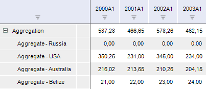

# IMsCrossDimensionAggregationTransform.AgregationMethod

IMsCrossDimensionAggregationTransform.AgregationMethod
-

# IMsCrossDimensionAggregationTransform.AgregationMethod

## Синтаксис

		AgregationMethod: [MsAgregationMethodType](../../Enums/MsAgregationMethodType.htm);

## Описание

Свойство AgregationMethod
 определяет метод агрегации.

## Комментарии

Для получения выражения агрегации используйте
 свойство [IMsCrossDimensionAggregationTransform.Expression](IMsCrossDimensionAggregationTransform.Expression.htm).

## Пример

Для выполнения примера в репозитории предполагается наличие формы, содержащей
 компонент Button с идентификатором
 BUTTON1, компонент LanerBox с
 идентификатором LANERBOX1 и компонент UiErAnalyzer
 с идентификатором UIERANALYZER1. Укажите UIERANALYZER1 в качестве источника
 данных для компонента LANERBOX1. В компонент UIERANALYZER1 должна быть
 загружена рабочая книга базы данных временных рядов.

Пример является обработчиком события OnClick
 для кнопки BUTTON1.

Добавьте ссылки на системные сборки: Cubes, Dimensions, Express, Laner,
 Metabase. Ms, Rds.

					Sub Button1OnClick(Sender: Object; Args: IMouseEventArgs);

		Var

		    mb: IMetabase;

		    Laner: ILaner;

		    CalcSerie: ILanerCalculateSerie;

		    Transform: IMsFormulaTransform;

		    Selector: IMsFormulaTransformSelector;

		    Formula: IMsFormula;

		    Method: IMsMethod;

		    Aggr: IMsCrossDimensionAggregationTransform;

		    TransformVar: IMsFormulaTransformVariable;

		    Options: IMsCrossDimensionAggregationOptions;

		    FilterList: IMsAggregationFilterList;

		    Filter: IMsAggregationFilter;

		    Rubr: IRubricator;

		    Attributes: IMetaAttributes;

		    DictDescr: IMetabaseObjectDescriptor;

		    FilterDimension: IMetabaseObject;

		    DimInst: IDimInstance;

		    Selection: IDimSelection;

		    i: Integer;

		Begin

		    mb := MetabaseClass.Active;

		    Laner := UiErAnalyzer1.ErAnalyzer.Laner;

		    Laner.BeginUpdate;

		    CalcSerie := Laner.Series.AddCalculateSerie("Aggregation");

		    Transform := CalcSerie.Transform.Transform As IMsFormulaTransform;

		    Selector := Transform.CreateSelector;

		    TransformVar := Transform.Outputs.Item(0);

		    Selector.Slice := TransformVar.Slices.Add(Null);

		    Formula := Transform.Transform(Selector);

		    Formula.Kind := MsFormulaKind.CrossDimensionAggregation;

		    Method := Formula.Method;

		    // Настройка агрегации

		    Aggr := Method As IMsCrossDimensionAggregationTransform;

		    // Задаем метод агрегации

		    Aggr.AgregationMethod := MsAgregationMethodType.Sum;

		    // Определяем дополнительные параметры агрегации

		    Options := Aggr.Options;

		    Options.Threshold := 0;

		    Options.Level := False;

		    Options.Rebase := False;

		    // Настраиваем фильтр агрегации

		    FilterList := Aggr.Filter;

		    FilterList.Clear;

		    Rubr := Laner.RubricatorInstance.Rubricator;

		    Attributes := Rubr.Facts.Attributes;

		    DictDescr := Attributes.FindById("COUNTRY").ValuesObject;

		    Filter := FilterList.Add(DictDescr.Bind As IDimensionModel);

		    FilterDimension := Filter.FilterDimension As IMetabaseObject;

		    DimInst := FilterDimension.Open(Null) As IDimInstance;

		    Selection := DimInst.CreateSelection;

		    For i := 0 To 3 Do

		        Selection.SelectElement(i, False);

		    End For;

		    Filter.AggregationSelection := Selection;

		    // Задаем измерение, по которому ведется агрегация

		    DictDescr := Attributes.FindById("INDICATOR").ValuesObject;

		    Aggr.AggregationDimenson := DictDescr.Bind As IDimensionModel;

		    // Задаем выражение агрегации

		    Aggr.Expression.AsString := "{BCA[t]}";

		    LanerBox1.ExecuteOperation(LanerBoxOperation.Refresh);

		    Laner.EndUpdate;

		End Sub Button1OnClick;

В результате выполнения примера в компонент LanerBox
 будет добавлен вычисляемый ряд AGGREGATION, рассчитанный методом агрегации.
 Агрегация будет рассчитана как сумма значений показателя BCA для первых
 четырех стран справочника, на который ссылается атрибут COUNTRY. Например:

См. также:

[IMsCrossDimensionAggregationTransform](IMsCrossDimensionAggregationTransform.htm)

		Справочная
		 система на версию 10.9
		 от 18/08/2025,
		 © ООО «ФОРСАЙТ»,
