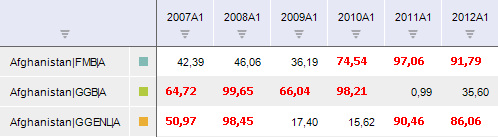

# IValidationFilter.Details

IValidationFilter.Details
-

# IValidationFilter.Details

## Синтаксис

Details: [IValidationDetails](../IValidationDetails/IValidationDetails.htm);

## Описание

Свойство Details возвращает
 специфические настройки правила валидации.

## Комментарии

В зависимости от значения свойства [IValidationFilter.Kind](IValidationFilter.Kind.htm),
 данное свойство может быть приведено к одному из следующих интерфейсов:

	- [IValidationCorrelation](../IValidationCorrelation/IValidationCorrelation.htm);

	- [IValidationCrossDatabase](../IValidationCrossDatabase/IValidationCrossDatabase.htm);

	- [IValidationCrossFrequency](../IValidationCrossFrequency/IValidationCrossFrequency.htm);

	- [IValidationCustom](../IValidationCustom/IValidationCustom.htm);

	- [IValidationGrowthRate](../IValidationGrowthRate/IValidationGrowthRate.htm);

	- [IValidationLevel](../IValidationLevel/IValidationLevel.htm);

	- [IValidationMissingData](../IValidationMissingData/IValidationMissingData.htm);

	- [IValidationMissingMetadata](../IValidationMissingMetadata/IValidationMissingMetadata.htm);

	- [IValidationRatio](../IValidationRatio/IValidationRatio.htm);

	- [IValidationRevisionComparison](../IValidationRevisionComparison/IValidationRevisionComparison.htm);

	- [IValidationStatisticalOutliers](../IValidationStatisticalOutliers/IValidationStatisticalOutliers.htm);

	- [IValidationTrend](../IValidationTrend/IValidationTrend.htm).

## Пример

Для выполнения примера предполагается наличие формы, содержащей компонент
 UiErAnalyzer1 с идентификатором UiErAnalyzer1 и компонент LanerBox с идентификатором
 LanerBox1, получающий данные из UiErAnalyzer1. В UiErAnalyzer1 должна
 быть загружена рабочая книга БД временных рядов с идентификатором TSDB.
 В данной базе предполагается наличие правила валидации с идентификатором
 OBJ_VALID_FILTER.

Добавьте ссылки на системные сборки: Cubes, Dimensions, Metabase, Ms.

			Sub UserProc;

Var

    Mb: IMetabase;

    RubrKey: Integer;

    ValidObj: IMetabaseObject;

    ValidFilter: IValidationFilter;

    DateSettings: IValidationDateSettings;

    FilterSett: IValidationFilterSettings;

    Level: IValidationLevel;

    ComparisonValue: IValidationComparisonValue;

    ValidExecSett: IValidationExecuteSettings;

    Analyzer: IEaxAnalyzer;

    ValidExecRun: IValidationExecRun;

    DiagRep: IDiagnosticReport;

Begin

    Mb := MetabaseClass.Active;

    // Получаем правило валидации

    RubrKey := Mb.GetObjectKeyById("TSDB");

    ValidObj := Mb.ItemByIdNamespace("OBJ_VALID_FILTER", RubrKey).Edit;

    ValidFilter := ValidObj As IValidationFilter;

    // Задаем начальную и конечную даты расчёта правила

    DateSettings := ValidFilter.StartDateSettings;

    DateSettings.DateOptions := ValidationDateOptions.DependsFromData;

    DateSettings := ValidFilter.EndDateSettings;

    DateSettings.DateOptions := ValidationDateOptions.DependsFromData;

    // Задаем уровень календаря для расчёта правила

    ValidFilter.Level := DimCalendarLevel.Year;

    // Задаем пороговое значение для исключений правила

    ValidFilter.ExceptionsLimit := 500000;

    // Задаем параметры расчёта правила

    FilterSett := ValidFilter.Settings;

    // Задаем тип правила

    ValidFilter.Kind := ValidationDetailsKind.Level;

    Level := ValidFilter.Details As IValidationLevel;

    // Задаем условия правила

    ComparisonValue := Level.ComparisonValue;

    ComparisonValue.ComparisonOperator := ValidationComparisonOperator.More;

    ComparisonValue.Percentage := False;

    ComparisonValue.Value1 := 50;

    // Сохраняем изменения в правиле

    ValidObj.Save;

    // Выполняем правило на загруженной рабочей книге

    ValidExecSett := New ValidationExecuteSettings.Create;

    Analyzer := UiErAnalyzer1.ErAnalyzer;

    ValidExecSett.Laner := Analyzer.Laner;

    ValidExecRun := ValidFilter.Execute(ValidExecSett);

    DiagRep := New DiagnosticReport.Create;

    DiagRep.Run := ValidExecRun;

    DiagRep.EaxAnalyzer := Analyzer;

End Sub UserProc;

После выполнения примера будет настроено правило валидации «Сравнение
 с числом»: выявляются годовые значения больше «50». Правило будет
 выполнено для загруженной рабочей книги, например:

См. также:

[IValidationFilter](IValidationFilter.htm)

		Справочная
		 система на версию 10.9
		 от 18/08/2025,
		 © ООО «ФОРСАЙТ»,
