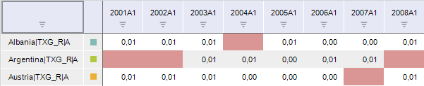

# IValidationMissingData

IValidationMissingData
-

# IValidationMissingData

Сборка: Ms;

## Описание

Интерфейс IValidationMissingData
 предназначен для работы с правилом валидации типа «Пропуски
 в данных».

## Иерархия наследования

           [IValidationDetails](../IValidationDetails/IValidationDetails.htm)

           IValidationMissingData

## Комментарии

Правило позволяет выявить пустые значения в данных. Пример рабочей книги
 после применения правила валидации «Пропуски
 в данных»:

Ячейки, содержащие пустые значения, подсвечены.

Для настройки параметров данного правила приведите значение, возвращаемое
 свойством [IValidationFilter.Details](../IValidationFilter/IValidationFilter.Details.htm),
 к интерфейсу IValidationMissingData.

## Свойства

		 Имя свойства
		 Краткое описание

		 
		 [SeriesMode](IValidationMissingData.SeriesMode.htm)
		 Свойство SeriesMode
		 определяет режим выгрузки выявленных исключений.

		 
		 [Type](IValidationMissingData.Type.htm)
		 Свойство Type определяет
		 тип пропусков.

## Свойства, унаследованные от [IValidationDetails](../IValidationDetails/IValidationDetails.htm)

		 Имя свойства
		 Краткое описание

		 
		 [Kind](../IValidationDetails/IValidationDetails.Kind.htm)

		 Свойство Kind возвращает
		 тип правила валидации.

		 
		 [SelectionFilter](../IValidationDetails/IValidationDetails.SelectionFilter.htm)

		 Свойство SelectionFilter
		 возвращает параметры фильтра, ограничивающего проверяемые ряды.

		 
		 [SelectionTargetData](../IValidationDetails/IValidationDetails.SelectionTargetData.htm)

		 Свойство SelectionTargetData
		 возвращает объект, определяющий данные, по которым будет выполняться
		 валидация.

См. также:

[Интерфейсы сборки Ms](../KeMs_Interface.htm)

		Справочная
		 система на версию 10.9
		 от 18/08/2025,
		 © ООО «ФОРСАЙТ»,
