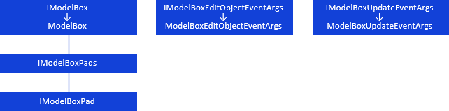
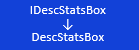
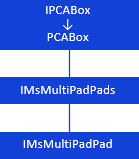

# Компоненты среды разработки, предназначенные для моделирования

Компоненты среды разработки, предназначенные для моделирования
-

# Компоненты среды разработки, предназначенные для моделирования

## ModelBox

Компонент [ModelBox](UiDevEnv.chm::/02_Components_constructor_forms/03_Components_of_the_access_to_data/ModelBox.htm)
 предназначен для отображения панелей настройки моделей, созданных в контейнере
 моделирования:

[

## DescStatsBox

Компонент DescStatsBox](../../Interface/IModelBox/IModelBox.htm)
 представляет панель, содержащую настройки, необходимые для расчета [описательных
 статистик](uimodelling.chm::/2_container_of_modeling/2_3_work_object/2_3_5_descriptive_value/uimodelling_work_object_descriptive.htm) переменных моделирования:

[

## PCABox

Компонент PCABox](../../Interface/IDescStatsBox/IDescStatsBox.htm)
 представляет панель, содержащую настройки, необходимые для расчета [метода
 главных компонент](uimodelling.chm::/2_container_of_modeling/2_3_work_object/2_3_7_methprincomp/uimodelling_work_object_methprincomp.htm):

[

## UiModel

Компонент UiModel](../../Interface/IPCABox/IPCABox.htm)
 является невизуальным, предназначен для предоставления доступа к моделям,
 созданным в контейнерах моделирования:

[

## Условные обозначения

		 
		 Класс_1
		 является потомком Интерфейса_1.

		 
		 Интерфейс_2 является потомком Интерфейса_1.

		 
		 Интерфейс_2
		 можно получить используя свойства/методы Интерфейса_1.

См. также:

Иерархия сборки Ms](../../Interface/IUiModel/IUiModel.htm)

		Справочная
		 система на версию 10.9
		 от 18/08/2025,
		 © ООО «ФОРСАЙТ»,
