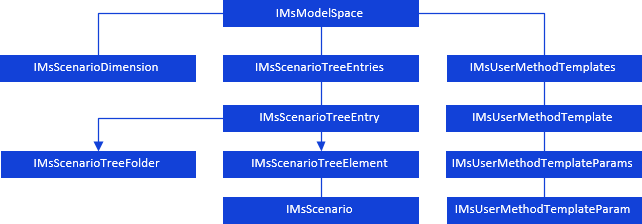

# Контейнер моделирования

Контейнер моделирования
-

# Контейнер моделирования

Контейнер моделирования - объект
 репозитория, предназначенный для формирования математических моделей процессов
 (явлений) и проведения расчетов на их основе.

Контейнер моделирования имеет следующую иерархию:

[

## Условные обозначения

		 
		 Класс_1
		 является потомком Интерфейса_1.

		 
		 Интерфейс_2 является потомком Интерфейса_1.

		 
		 Интерфейс_2
		 можно получить используя свойства/методы Интерфейса_1.

См. также:

Иерархия сборки Ms](../../Interface/IMsModelSpace/IMsModelSpace.htm)

		Справочная
		 система на версию 10.9
		 от 18/08/2025,
		 © ООО «ФОРСАЙТ»,
