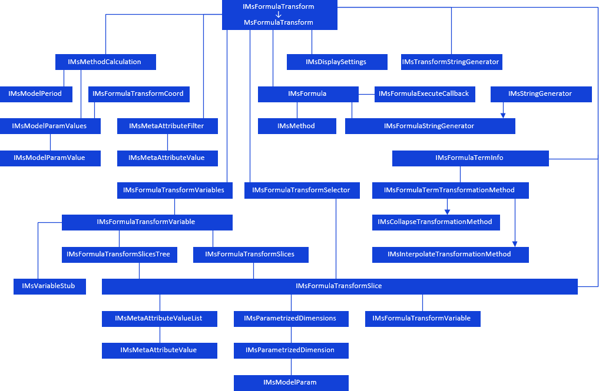

# Параметры модели

Параметры модели
-

# Параметры модели

Для настройки параметров модели используется интерфейсы:

[

## Условные обозначения

		 
		 Класс_1
		 является потомком Интерфейса_1.

		 
		 Интерфейс_2 является потомком Интерфейса_1.

		 
		 Интерфейс_2
		 можно получить используя свойства/методы Интерфейса_1.

См. также:

Иерархия сборки Ms](../../Interface/IMsFormulaTransform/IMsFormulaTransform.htm)

		Справочная
		 система на версию 10.9
		 от 18/08/2025,
		 © ООО «ФОРСАЙТ»,
