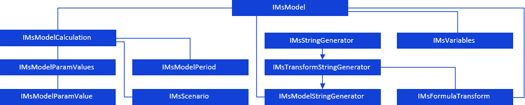

# Модель

Модель
-

# Модель

Для работы с моделью через язык Fore
 предназначен интерфейс [IMsModel](../../Interface/IMsModel/IMsModel.htm).
 Используя его свойства и методы можно задать периоды идентификации, прогнозирования
 модели, задать метод расчета и настроить прочие параметры модели.

Модель имеет следующую иерархию:

[

## Условные обозначения

		 
		 Класс_1
		 является потомком Интерфейса_1.

		 
		 Интерфейс_2 является потомком Интерфейса_1.

		 
		 Интерфейс_2
		 можно получить используя свойства/методы Интерфейса_1.

См. также:

Иерархия сборки Ms](../../Interface/IMsModel/IMsModel.htm)

		Справочная
		 система на версию 10.9
		 от 18/08/2025,
		 © ООО «ФОРСАЙТ»,
