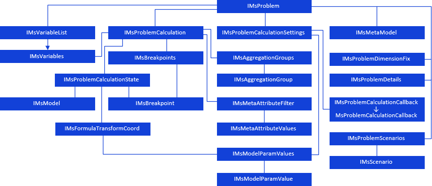
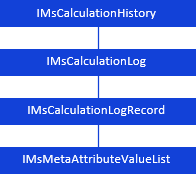

# Задача моделирования

Задача моделирования
-

# Задача моделирования

Задача моделирования - объект,
 выполняющий последовательный расчёт моделей из указанной метамодели с
 целью получения выходных данных в результирующих переменных.

Задача моделирования имеет следующую иерархию:

[

## ](../../Interface/IMsProblem/IMsProblem.htm)История
 расчета задачи моделирования

[

## Условные обозначения

		 
		 Класс_1
		 является потомком Интерфейса_1.

		 
		 Интерфейс_2 является потомком Интерфейса_1.

		 
		 Интерфейс_2
		 можно получить используя свойства/методы Интерфейса_1.

См. также:

Иерархия сборки Ms](../../Interface/IMsCalculationHistory/IMsCalculationHistory.htm)

		Справочная
		 система на версию 10.9
		 от 18/08/2025,
		 © ООО «ФОРСАЙТ»,
