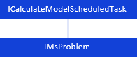
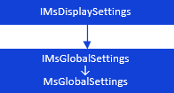
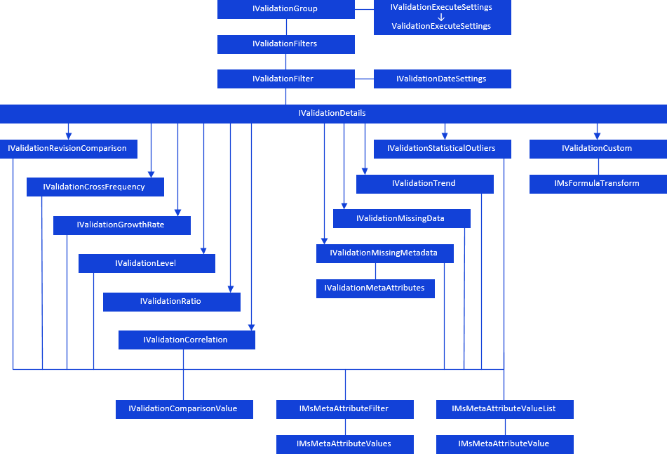

# Прочие объекты

Прочие объекты
-

# Прочие объекты

В сборку Ms, кроме [контейнера моделирования](KeMs_H_IMSModelSace.htm)
 и [компонент](KeMs_H_Components.htm), входят объекты:

		 Объект контейнера запланированных задач
		 Глобальные настройки контейнера моделирования
		 Матрица

		 

		[

		 

		 

# ](../../Interface/ICalculateModelScheduledTask/ICalculateModelScheduledTask.htm)Группа валидации

Для работы с группой правил валидации используются интерфейсы:

[

## Условные обозначения

		 
		 Класс_1
		 является потомком Интерфейса_1.

		 
		 Интерфейс_2 является потомком Интерфейса_1.

		 
		 Интерфейс_2
		 можно получить используя свойства/методы Интерфейса_1.

См. также:

Иерархия сборки Ms](../../Interface/IValidationExecuteSettings/IValidationExecuteSettings.htm)

		Справочная
		 система на версию 10.9
		 от 18/08/2025,
		 © ООО «ФОРСАЙТ»,
