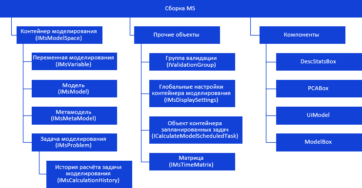

# Иерархия сборки Ms

Иерархия сборки Ms
-

# Иерархия сборки Ms

Все классы и интерфейсы в сборке Ms
 можно разделить на несколько приведённых ниже групп.

[

Все названия компонентов/классов/интерфейсов являются гиперссылками,
 для перехода к их подробному описанию щёлкните по ним мышью.

См. также:

Классы сборки Ms](Hierarchy/KeMs_H_IMSModelSace.htm)
 | [Интерфейсы
 сборки Ms](../Interface/KeMs_Interface.htm) | [Перечисления сборки Ms](../Enums/KeMs_Enums.htm)
 | [Примеры](../Samples/KeMs_Sample.htm)

		Справочная
		 система на версию 10.9
		 от 18/08/2025,
		 © ООО «ФОРСАЙТ»,
