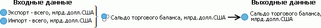

# Общие принципы программирования с использованием сборки Ms

Общие принципы программирования с использованием сборки Ms
-

# Общие принципы программирования
 с использованием сборки Ms

Сборка Ms предназначена для
 моделирования. Программирование на Fore с использованием данной сборки
 заключается в последовательном создании и настройке объектов контейнера
 моделирования, направленном на решение задач математического моделирования
 динамических систем.

В процессе моделирования участвуют следующие объекты:

	- [Переменная](KeMs_Programming_Var.htm).
	 Служит для получения исходных данных и выгрузки результатов выполнения
	 алгоритма расчёта. Для работы с переменной предназначен интерфейс
	 [IMsVariable](../Interface/IMsVariable/IMsVariable.htm);

	- [Модель](KeMs_Programming_Model.htm).
	 Эквивалент реального процесса, отражающий в математической форме важнейшие
	 его свойства: законы, которым он подчиняется; связи, присущие составляющим
	 его частям, и т.д. Предназначена для задания параметров преобразования
	 исходных переменных статистическими и математическими методами. Для
	 работы с моделью предназначен интерфейс [IMsModel](../Interface/IMsModel/IMsModel.htm);

	- [Метамодель](KeMs_Programming_MetaModel.htm).
	 Модель, которая описывает структуру и иерархическую последовательность
	 расчёта других моделей. Для работы с метамоделью предназначен интерфейс
	 [IMsMetaModel](../Interface/IMsMetaModel/IMsMetaModel.htm);

	- [Сценарий](KeMs_Programming_Scenario.htm).
	 Совокупность исходных данных и предположений, используемых при моделировании.
	 После расчёта в моделируемой переменной создаётся сценарный ряд, по
	 которому будут расположены рассчитанные данные. Для работы со сценарием
	 предназначен интерфейс [IMsScenarioTreeElement](../Interface/IMsScenarioTreeElement/IMsScenarioTreeElement.htm);

	- [Задача
	 моделирования](KeMs_Programming_Problem.htm). Осуществляет расчёт моделей на основе последовательности,
	 заданной метамоделью. Предназначена для получения и выгрузки результатов
	 расчёта в заданные переменные. Для работы с задачей моделирования
	 предназначен интерфейс [IMsProblem](../Interface/IMsProblem/IMsProblem.htm).

Работа с данными объектами ведётся в среде [контейнера
 моделирования](UiModelling.chm::/1_Modelling/UiModelling_First.htm), для работы с которым предназначен интерфейс
 [IMsModelSpace](../Interface/IMsModelSpace/IMsModelSpace.htm).

Моделирование осуществляется по схеме:

[

Далее, в качестве примера, будет описано последовательное моделирование
 сальдо торгового баланса. Сальдо торгового баланса - это разность экспорта
 и импорта, поэтому моделирование не будет сложным:

Прежде всего, необходим контейнер моделирования. Процесс его создания
 описан в примере «Создание контейнера
 моделирования](KeMs_Programming_Var.htm#vars_create)». Для дальнейших действий создайте свой собственный
 контейнер моделирования с идентификатором MODEL_SPACE. Затем выполните
 следующие этапы:

	- [создание переменных](KeMs_Programming_Var.htm#vars_create);

	- [создание модели](KeMs_Programming_Model.htm#model_create);

	- [создание
	 метамодели](KeMs_Programming_MetaModel.htm#metamodel_create);

	- [создание
	 и расчёт задачи моделирования](KeMs_Programming_Problem.htm#problem_create);

	- [просмотр итоговых
	 результатов](KeMs_Programming_result_view.htm).

См. также:

[Классы сборки Ms](../Class/KeMs_Classes.htm)
 | [Интерфейсы
 сборки Ms](../Interface/KeMs_Interface.htm) | [Перечисления сборки Ms](../Enums/KeMs_Enums.htm)
 | [Примеры](../Samples/KeMs_Sample.htm)
 | [Иерархия
 сборки Ms](KeMs_Hierarchy.htm)

		Справочная
		 система на версию 10.9
		 от 18/08/2025,
		 © ООО «ФОРСАЙТ»,
