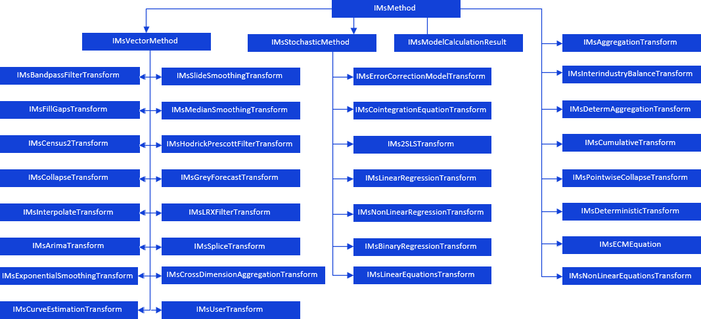

# Модель

Модель
-

# Модель

При создании и работе с моделью следует учитывать следующие особенности:

	- класс объекта «[Модель](UiModelling.chm::/2_Container_of_Modeling/2_3_Work_object/2_3_2_Model/UiModelling_Model.htm)»
	 - MetabaseObjectClass.KE_CLASS_MSMODEL;

	- обязательно необходимо указывать родительский контейнер, так
	 как модель может располагаться только внутри контейнера;

	- по умолчанию каждая создаваемая модель содержит годовую динамику.

Для работы с моделью через язык Fore предназначен интерфейс [IMsModel](../Interface/IMsModel/IMsModel.htm).
 Используя его свойства и методы можно задать периоды идентификации, прогнозирования
 модели, задать метод расчета и настроить прочие параметры модели.

Примечание.
 В примерах, представленных ниже, предполагается наличие объектов, которые
 указаны в разделе описания переменных.

Для работы с параметрами метода расчета модели обязательно необходимо
 задать моделируемую переменную и ее срез. Переменная должна быть добавлена
 в коллекцию входных переменных модели. Только после этого возможно получить
 объект, реализованный интерфейсом [IMsFormula](../Interface/IMsFormula/IMsFormula.htm),
 для настройки параметров расчета модели:

	Sub UserProc;

	Var

	    Model: IMsModel;

	    TransfModel: IMsFormulaTransform;

	    Varr: IMsVariable;

	    ModellingVar: IMsFormulaTransformVariable;

	    Tree: IMsFormulaTransformSlicesTree;

	    Slice: IMsFormulaTransformSlice;

	    Selector: IMsFormulaTransformSelector;

	    Formula: IMsFormula;

	Begin

	    TransfModel := Model.Transform;

	    ModellingVar := TransfModel.Outputs.Add(Varr As IVariableStub);

	    Tree := ModellingVar.SlicesTree(ModellingVar);

	    Slice := Tree.CreateSlice(1);

	    Selector := TransfModel.CreateSelector;

	    Selector.Slice := Slice;

	    Formula := TransfModel.Transform(Selector);

	End Sub UserProc;

Используя свойства/методы интерфейса [IMsFormula](../Interface/IMsFormula/IMsFormula.htm)
 можно изменить календарную динамику, а также определить и настроить параметры
 метода расчета модели.

Метод расчета модели реализован интерфейсом [IMsMethod](../Interface/IMsMethod/IMsMethod.htm).
 Данный интерфейс является базовым для всех методов расчета:

[

Для настройки конкретного метода расчета интерфейс IMsMethod](../Interface/IMsMethod/IMsMethod.htm)
 нужно привести к какому-либо из дочерних интерфейсов. Например, для расчета
 фильтра Бакстера-Кинга [IMsMethod](../Interface/IMsMethod/IMsMethod.htm)
 нужно привести к интерфейсу [IMsBandpassFilterTransform](../Interface/IMsBandpassFilterTransform/IMsBandpassFilterTransform.htm):

	Sub UserProc;

	Var

	    Formula: IMsFormula;

	    BPFilter: IMsBandpassFilterTransform;

	Begin

	    Formula.Kind := MsFormulaKind.BandpassFilter;

	    BPFilter := Formula.Method As IMsBandpassFilterTransform;

	End Sub UserProc;

Дальнейшее программирование параметров модели зависит от ее метода расчета.
 Более подробную информацию об этом можно найти в описании соответствующих
 интерфейсов.

## Создание модели

После [создания переменных](KeMs_Programming_Var.htm#vars_create)
 можно приступить к созданию модели «Сальдо торгового баланса, млрд.долл.США»
 и настройке параметров ее расчета:

	- моделируемая переменная: «Сальдо торгового баланса, млрд.долл.США»;

	- входные переменные: «Экспорт - всего, млрд.долл.США», «Импорт
	 - всего, млрд.долл.США»;

	- вид модели: [детерминированное
	 уравнение](../Interface/IMsDeterministicTransform/IMsDeterministicTransform.htm);

	- формула расчета: разность значений переменных «Экспорт - всего,
	 млрд.долл.США» и «Импорт - всего, млрд.долл.США».

Для выполнения модуля по созданию и настройке модели «Сальдо торгового
 баланса, млрд.долл.США» необходимо добавить ссылки на сборки: Dimensions,
 Metabase, Ms .

	Sub UserProc;

	Var

	    MB: IMetabase;

	    MsDescr, VarDescr: IMetabaseObjectDescriptor;

	    CrInf: IMetabaseObjectCreateInfo;

	    MObj: IMetabaseObject;

	    Model: IMsModel;

	    TransfModel: IMsFormulaTransform;

	    Varr: IMsVariable;

	    Var_Balance, Var_Exp, Var_Imp: IMsFormulaTransformVariable;

	    Tree: IMsFormulaTransformSlicesTree;

	    Slice: IMsFormulaTransformSlice;

	    Selector: IMsFormulaTransformSelector;

	    Formula: IMsFormula;

	    Determ: IMsDeterministicTransform;

	    Inputs: IMsFormulaTransformVariables;

	    Term_Exp, Term_Imp: IMsFormulaTerm;

	Begin

	    MB := MetabaseClass.Active;

	    // Создаем модель

	    CrInf := Mb.CreateCreateInfo;

	    CrInf.ClassId := MetabaseObjectClass.KE_CLASS_MSMODEL;

	    CrInf.Id := "BALANCE_MODEL";

	    CrInf.Name := "Сальдо торгового баланса, млрд.долл.США";

	    MsDescr := Mb.ItemById("MODEL_SPACE");

	    CrInf.Parent := MsDescr;

	    MObj := Mb.CreateObject(CrInf).Edit;

	    Model := MObj As IMsModel;

	    // Получаем объект для настройки параметров модели

	    TransfModel := Model.Transform;

	    // Задаем моделируемую переменную

	    VarDescr := MB.ItemByIdNamespace("BALANCE", MsDescr.Key);

	    Varr := VarDescr.Bind As IMsVariable;

	    Var_Balance := TransfModel.Outputs.Add(Varr As IVariableStub);

	    Tree := Var_Balance.SlicesTree(Var_Balance);

	    Slice := Tree.CreateSlice(1);

	    Selector := TransfModel.CreateSelector;

	    Selector.Slice := Slice;

	    // Получаем объект для настройки параметров расчета модели

	    Formula := TransfModel.Transform(Selector);

	    Formula.Kind := MsFormulaKind.Deterministic;

	    Formula.Level := DimCalendarLevel.Year;

	    // Настраиваем расчет детерминированного уравнения

	    Determ := Formula.Method As IMsDeterministicTransform;

	    Inputs := TransfModel.Inputs;

	    // Добавляем в модель входную переменную «Экспорт - всего, млрд.долл.США»

	    VarDescr := MB.ItemByIdNamespace("EXPORT", MsDescr.Key);

	    Varr := VarDescr.Bind As IMsVariable;

	    Var_Exp := Inputs.Add(Varr As IVariableStub);

	    Tree := Var_Exp.SlicesTree(Var_Exp);

	    Slice := Tree.CreateSlice(1);

	    Term_Exp := Determ.Operands.Add(Slice);

	    // Добавляем в модель входную переменную «Импорт - всего, млрд.долл.США»

	    VarDescr := MB.ItemByIdNamespace("IMPORT", MsDescr.Key);

	    Varr := VarDescr.Bind As IMsVariable;

	    Var_Imp := Inputs.Add(Varr As IVariableStub);

	    Tree := Var_Imp.SlicesTree(Var_Imp);

	    Slice := Tree.CreateSlice(1);

	    Term_Imp := Determ.Operands.Add(Slice);

	    // Задаем формулу для расчета модели

	    Determ.Expression.AsString := Term_Exp.TermToInnerText + " - " + Term_Imp.TermToInnerText;

	    MObj.Save;

	    Debug.WriteLine("Создана и настроена модель '" + MObj.Name + "' с идентификатором '" + MObj.Id + "'");

	End Sub UserProc;

После выполнения модуля будет создана и настроена модель «Сальдо торгового
 баланса, млрд.долл.США» с идентификатором BALANCE_MODEL, информация об
 этом будет выведена в окно консоли.

Следующим шагом будет [создание
 метамодели](KeMs_Programming_MetaModel.htm#metamodel_create).

См. также:

[Общие принципы программирования с использованием
 сборки Ms](KeMs_Programming.htm)

		Справочная
		 система на версию 10.9
		 от 18/08/2025,
		 © ООО «ФОРСАЙТ»,
