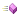

# INeuralNetwork

INeuralNetwork
-

# INeuralNetwork

Сборка: NN;

## Описание

Интерфейс INeuralNetwork предназначен
 для работы с искусственными нейронными сетями.

## Иерархия наследования

           INeuralNetwork

## Комментарии

Используя данный интерфейс, можно создать, обучить и использовать сеть
 обратного распространения или самоорганизующуюся карту Кохонена.

## Методы

		 Имя метода
		 Краткое описание

		 
		 [ApplyConvexCombinationFactor](INeuralNetwork.ApplyConvexCombinationFactor.htm)
		 Метод ApplyConvexCombinationFactor
		 применяет выпуклое комбинаторное преобразование к входным элементам
		 сети.

		 
		 [CreateNetwork](INeuralNetwork.CreateNetwork.htm)
		 Метод CreateNetwork
		 создает нейронную сеть по заданному строковому представлению.

		 
		 [CreateNetworkEx](INeuralNetwork.CreateNetworkEx.htm)
		 Метод CreateNetworkEx
		 создает нейронную сеть по заданным параметрам.

		 
		 [DeleteNetwork](INeuralNetwork.DeleteNetwork.htm)
		 Метод DeleteNetwork
		 удаляет нейронную сеть.

		 
		 [DeltasMinimumReachedBP](INeuralNetwork.DeltasMinimumReachedBP.htm)
		 Метод DeltasMinimumReachedBP
		 возвращает признак того, что значение delta
		 достигло заданного уровня.

		 
		 [ExportSynapses](INeuralNetwork.ExportSynapses.htm)
		 Метод ExportSynapses
		 возвращает строковое представление сети.

		 
		 [GetClosestNeuron](INeuralNetwork.GetClosestNeuron.htm)
		 Метод GetClosestNeuron
		 возвращает индекс нейрона, вектор веса которого меньше всего отличается
		 от тестируемого входного вектора.

		 
		 [GetError](INeuralNetwork.GetError.htm)
		 Метод GetError возвращает
		 код последней ошибки нейронной сети.

		 
		 [GetInputValues](INeuralNetwork.GetInputValues.htm)
		 Метод GetInputValues
		 возвращает вещественный массив входных значений сети.

		 
		 [GetLearnRadius](INeuralNetwork.GetLearnRadius.htm)
		 Метод GetLearnRadius
		 возвращает значение шага обучения для указанного слоя.

		 
		 [GetLearnRate](INeuralNetwork.GetLearnRate.htm)
		 Метод GetLearnRate
		 возвращает значение коэффициента обучения для указанного слоя.

		 
		 [GetMaximumWeightDelta](INeuralNetwork.GetMaximumWeightDelta.htm)
		 Метод GetMaximumWeightDelta
		 возвращает максимальное значение delta
		 среди всех весов синапсов.

		 
		 [GetNumberOfInputs](INeuralNetwork.GetNumberOfInputs.htm)
		 Метод GetNumberOfInputs
		 возвращает количество входов сети.

		 
		 [GetNumberOfLayers](INeuralNetwork.GetNumberOfLayers.htm)
		 Метод GetNumberOfLayers
		 возвращает число слоев в нейронной сети.

		 
		 [GetNumberOfOutputs](INeuralNetwork.GetNumberOfOutputs.htm)
		 Метод GetNumberOfOutputs
		 возвращает число выходов сети.

		 
		 [GetOutputValues](INeuralNetwork.GetOutputValues.htm)
		 Метод GetOutputValues
		 возвращает массив выходных значений сети.

		 
		 [GetOutputWidth](INeuralNetwork.GetOutputWidth.htm)
		 Метод GetOutputWidth возвращает
		 число строк в выходном слое самоорганизующейся карты Кохонена.

		 
		 [GetRowWidth](INeuralNetwork.GetRowWidth.htm)
		 Метод GetRowWidth возвращает
		 число строк в выходном слое самоорганизующейся карты Кохонена.

		 
		 [GetRowWidthEx](INeuralNetwork.GetRowWidthEx.htm)
		 Метод GetRowWidthEx возвращает
		 число строк в указанном слое самоорганизующейся карты Кохонена.

		 
		 [GetSynapse](INeuralNetwork.GetSynapse.htm)
		 Метод GetSynapse возвращает
		 значение веса указанного синапса.

		 
		 [GetUseVectorScalar](INeuralNetwork.GetUseVectorScalar.htm)
		 Метод GetUseVectorScalar
		 возвращает признак того, используется ли алгоритм скалярного умножения
		 векторов для вычисления расстояния между нейронами указанного
		 слоя.

		 
		 [ImportSynapses](INeuralNetwork.ImportSynapses.htm)
		 Метод ImportSynapses
		 загружает значения весов синапсов из строкового представления.

		 
		 [InitSynapses](INeuralNetwork.InitSynapses.htm)
		 Метод InitSynapses
		 задает значения весов синапсов для указанного слоя по заданным
		 параметрам.

		 
		 [InitSynapsesConvex](INeuralNetwork.InitSynapsesConvex.htm)
		 Метод InitSynapsesConvex задает
		 значения весов синапсов используя алгоритм выпуклой комбинации.

		 
		 [InitSynapsesConvexEx](INeuralNetwork.InitSynapsesConvexEx.htm)
		 Метод InitSynapsesConvexEx
		 задает значения весов синапсов для указанного слоя используя
		 алгоритм выпуклой комбинации.

		 
		 [LearnBack](INeuralNetwork.LearnBack.htm)
		 Метод LearnBack выполняет
		 итерацию по обучению сети обратного распространения.

		 
		 [LearnSOFM](INeuralNetwork.LearnSOFM.htm)
		 Метод LearnSOFM выполняет
		 обучение самоорганизующейся карты Кохонена.

		 
		 [NormalizeInputValues](INeuralNetwork.NormalizeInputValues.htm)
		 Метод NormalizeInputValues
		 нормализует входные данные сети.

		 
		 [NormalizeInputValuesEx](INeuralNetwork.NormalizeInputValuesEx.htm)
		 Метод NormalizeInputValuesEx
		 нормализует входные данные указанного слоя.

		 
		 [NormalizeSynapses](INeuralNetwork.NormalizeSynapses.htm)
		 Метод NormalizeSynapses
		 нормализует значения весов синапсов всех слоев сети.

		 
		 [NormalizeSynapsesEx](INeuralNetwork.NormalizeSynapsesEx.htm)
		 Метод NormalizeSynapsesEx
		 нормализует значения весов для синапсов указанного слоя.

		 
		 [PropagateBP](INeuralNetwork.PropagateBP.htm)
		 Метод PropagateBP выполняет
		 распространение сигнала в сети обратного распространения.

		 
		 [PropagateSOFM](INeuralNetwork.PropagateSOFM.htm)
		 Метод PropagateSOFM
		 распространяет сигнал по самоорганизующейся сети Кохонена.

		 
		 [SetInputValues](INeuralNetwork.SetInputValues.htm)
		 Метод SetInputValues
		 устанавливает входные значения сети.

		 
		 [SetInputValuesConvex](INeuralNetwork.SetInputValuesConvex.htm)
		 Метод SetInputValuesConvex
		 устанавливает входные значения сети с использованием выпуклого
		 комбинаторного преобразования.

		 
		 [SetInputValuesConvexEx](INeuralNetwork.SetInputValuesConvexEx.htm)
		 Метод SetInputValuesConvexEx
		 устанавливает входные значения сети с использованием выпуклого
		 комбинаторного преобразования и возможностью нормализации.

		 
		 [SetLearnRadius](INeuralNetwork.SetLearnRadius.htm)
		 Метод SetLearnRadius
		 устанавливает шаг обучения сети.

		 
		 [SetLearnRadiusEx](INeuralNetwork.SetLearnRadiusEx.htm)
		 Метод SetLearnRadiusEx устанавливает
		 шаг обучения сети.

		 
		 [SetLearnRate](INeuralNetwork.SetLearnRate.htm)
		 Метод SetLearnRate
		 устанавливает коэффициент обучения.

		 
		 [SetLearnRateEx](INeuralNetwork.SetLearnRateEx.htm)
		 Метод SetLearnRateEx устанавливает
		 коэффициент обучения для указанного слоя.

		 
		 [SetMju](INeuralNetwork.SetMju.htm)
		 Метод SetMju устанавливает
		 коэффициент момента инерции для обучения всех слоев сети обратного
		 распространения.

		 
		 [SetMjuEx](INeuralNetwork.SetMjuEx.htm)
		 Метод SetMjuEx устанавливает
		 коэффициент момента инерции обучения для указанного слоя сети
		 обратного распространения.

		 
		 [SetNju](INeuralNetwork.SetNju.htm)
		 Метод SetNju устанавливает
		 скорость обучения сети с обратным распространением.

		 
		 [SetNjuEx](INeuralNetwork.SetNjuEx.htm)
		 Метод SetNjuEx устанавливает
		 скорость обучения для указанного слоя сети с обратным распространением.

		 
		 [SetOutputWidth](INeuralNetwork.SetOutputWidth.htm)
		 Метод SetOutputWidth устанавливает
		 число строк в выходном слое самоорганизующейся карты Кохонена.

		 
		 [SetRowWidth](INeuralNetwork.SetRowWidth.htm)
		 Метод SetRowWidth устанавливает
		 число строк в выходном слое самоорганизующейся карты Кохонена.

		 
		 [SetRowWidthEx](INeuralNetwork.SetRowWidthEx.htm)
		 Метод SetRowWidthEx устанавливает
		 число строк в указанном слое самоорганизующейся карты Кохонена.

		 
		 [SetSigmoidAlpha](INeuralNetwork.SetSigmoidAlpha.htm)
		 Метод SetSigmoidAlpha
		 устанавливает значение коэффициента Alpha
		 для сигмоидальных функций распространения сигнала в сети.

		 
		 [SetSigmoidFuncs](INeuralNetwork.SetSigmoidFuncs.htm)
		 Метод SetSigmoidFuncs
		 устанавливает тип распространения сигнала в сети.

		 
		 [SetSigmoidFuncsEx](INeuralNetwork.SetSigmoidFuncsEx.htm)
		 Метод SetSigmoidFuncs
		 устанавливает тип распространения сигнала в сети для указанного
		 слоя.

		 
		 [SetSynapse](INeuralNetwork.SetSynapse.htm)
		 Метод SetSynapse
		 устанавливает значение веса указанного синапса.

		 
		 [SetUseVectorScalar](INeuralNetwork.SetUseVectorScalar.htm)
		 Метод SetUseVectorScalar
		 определяет, применять ли алгоритм скалярного умножения векторов
		 для вычисления расстояния между нейронами.

		 
		 [SetUseVectorScalarEx](INeuralNetwork.SetUseVectorScalarEx.htm)
		 Метод SetUseVectorScalarEx
		 определяет, применять ли алгоритм скалярного умножения векторов
		 для вычисления расстояния между нейронами указанного слоя.

См. также:

[Интерфейсы
 сборки NN](../KeNN_Interface.htm)

		Справочная
		 система на версию 10.9
		 от 18/08/2025,
		 © ООО «ФОРСАЙТ»,
