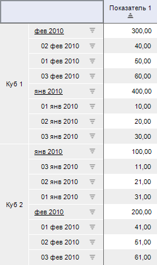
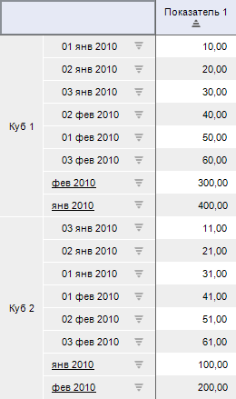
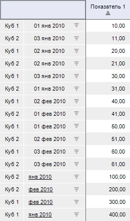
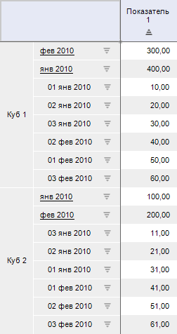

# PivotSortDiapason

PivotSortDiapason
-

# PivotSortDiapason

## Описание

Перечисление PivotSortDiapason
 содержит режимы, в которых будет осуществляться сортировка в таблице.

Используется свойством [IPivot.SortDiapason](../Interface/IPivot/IPivot.SortDiapason.htm).

## Допустимые значения

		 Значение
		 Краткое описание

		 1
		 Owner. Внутри иерархии:

		

		 2
		 Level. По уровням
		 иерархии:

		

		 3
		 Group. По всему
		 измерению внутри одной группы:

		

		 4
		 All. По всему измерению
		 без учета групп:

		

		 5
		 HierarchyLevel.
		 По всем уровням:

		

## Комментарии

При получении изображений для различных режимов сортировки были
 использованы следующие исходные данные:

См. также:

[Перечисления сборки Pivot](KePivot_Enums.htm)

		Справочная
		 система на версию 10.9
		 от 18/08/2025,
		 © ООО «ФОРСАЙТ»,
