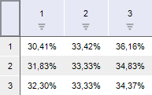
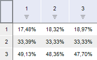

# PivotValueArea

PivotValueArea
-

# PivotValueArea

## Описание

Перечисление PivotValueArea
 содержит области представления данных.

Используется следующими свойствами:

	- [IPivot.RankAreaType](../Interface/IPivot/IPivot.RankAreaType.htm);

	- [IPivot.ValueAreaType](../Interface/IPivot/IPivot.ValueAreaType.htm).

## Допустимые значения

		 Значение
		 Краткое описание

		 0
		 Table. По всей таблице.

(Представление данных осуществляется в процентном
		 формате)

		 1
		 Row. В текущей строке.

(Представление данных осуществляется в процентном
		 формате)

		 2
		 Column. В текущем столбце.

(Представление данных осуществляется в процентном
		 формате)

См. также:

[Перечисления сборки Pivot](KePivot_Enums.htm)

		Справочная
		 система на версию 10.9
		 от 18/08/2025,
		 © ООО «ФОРСАЙТ»,
