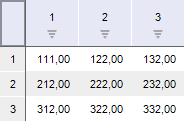
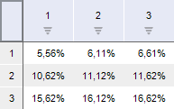
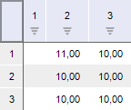
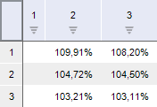
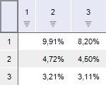

# PivotValueType

PivotValueType
-

# PivotValueType

## Описание

Перечисление PivotValueType содержит форматы представления данных в таблицы.

Используется свойством [IPivot.ValueType](../Interface/IPivot/IPivot.ValueType.htm).

## Допустимые значения

 Значение
 Краткое описание

 0
 Absolute. Абсолютные значения.

 1
 Percentage. Процент (к сумме в таблице, строке, столбце).

 2
 Change. Изменение (по строке, по столбцу).

(Представление данные осуществляется по строкам)

 3
 Growth. Рост в процентах (по строке, по столбцу).

(Представление данные осуществляется по строкам)

 4
 GrowthRate. Прирост в процентах (по строке, по столбцу).

(Представление данные осуществляется по строкам)

См. также:

[Перечисления сборки Pivot](KePivot_Enums.htm)

		Справочная
		 система на версию 10.9
		 от 18/08/2025,
		 © ООО «ФОРСАЙТ»,
