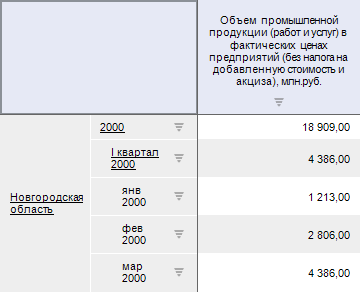
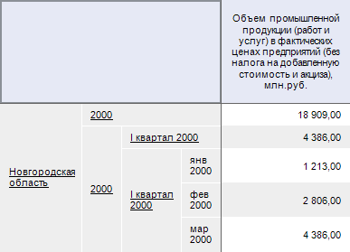

# PivotViewMode

PivotViewMode
-

# PivotViewMode

## Описание

Перечисление PivotViewMode содержит
 режимы отображения таблицы с данными.

Используется свойством [IPivot.ViewMode](../Interface/IPivot/IPivot.ViewMode.htm).

## Допустимые значения

		 Значение
		 Краткое описание

		 0
		 DimInSlot. Элементы
		 одного измерение отображается в одном отдельном слоте заголовка
		 (Для элементов разных уровней могут быть настроены [отступы](KeExpress.chm::/Interface/IEaxGridDimensionSettings/IEaxGridDimensionSettings.htm)).

		 1
		 LevInSlot. Элементы
		 каждого уровня измерения отображается в отдельном слоте заголовка.

		 2
		 Default. Используется
		 режим отображения, заданный для всего отчета. Данное значение
		 используется по умолчанию.

См. также:

[Перечисления
 сборки Pivot](KePivot_Enums.htm)

		Справочная
		 система на версию 10.9
		 от 18/08/2025,
		 © ООО «ФОРСАЙТ»,
