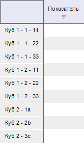
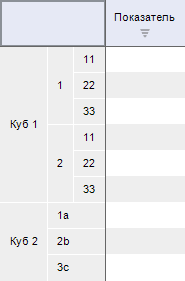

# PivotViewOptions

PivotViewOptions
-

# PivotViewOptions

## Описание

Перечисление PivotViewOptions
 содержит режимы отображения таблицы с данными при наличии составных измерений
 в источнике.

Используется свойством [IPivot.ViewOptions](../Interface/IPivot/IPivot.ViewOptions.htm).

## Допустимые значения

		 Значение
		 Краткое описание

		 0
		 None. Наименования
		 элементов отображаются в одном слоте.

		 1
		 DimIndentInSlot. Наименования
		 источников, а также наименования элементов по отдельным измерениям,
		 отображаются в отдельных слотах заголовка.

См. также:

[Перечисления
 сборки Pivot](KePivot_Enums.htm)

		Справочная
		 система на версию 10.9
		 от 18/08/2025,
		 © ООО «ФОРСАЙТ»,
