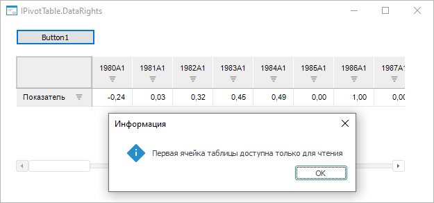

# IPivot.CalculateDataRights

IPivot.CalculateDataRights
-

# IPivot.CalculateDataRights

## Синтаксис

CalculateDataRights: Boolean;

## Описание

Свойство CalculateDataRights
 определяет признак расчёта прав доступа пользователя к ячейкам таблицы.

## Комментарии

Допустимые значения:

	- True. По умолчанию.
	 Права доступа будут рассчитываться;

	- False.
	 Права доступа не будут рассчитываться.

Свойство актуально для использования при построении таблицы с помощью
 метода [IPivot.ObtainTable](IPivot.ObtainTable.htm). Если для
 пользователей разграничены права доступа на ячейки таблицы, то при расчёте
 прав доступа можно будет определить операции, доступные конкретному пользователю
 над ячейками таблицы, с помощью перечисления [CubeDataRights](kecubes.chm::/enums/cubedatarights.htm).

Для получения подробной информации о правах доступа пользователя к ячейкам
 таблицы обратитесь к разделу «[Отображение
 прав доступа к данным в виде пиктограмм](UiAnalyticalArea.chm::/TableView/Formatting/Cells_icons.htm)».

## Пример

Для выполнения примера предполагается наличие формы, расположенного
 на ней компонента Button с наименованием
 «Button1», компонента TabSheetBox
 с наименованием «TabSheetBox1» и компонента UiErAnalyzer
 с наименованием «UiErAnalyzer1», являющегося источником данных для TabSheetBox. В «UiErAnalyzer1» должен быть загружен
 экспресс-отчет. Пользователю должны быть даны права только на чтение к
 первой ячейке таблицы.

Добавьте ссылки на системные сборки: Express, Tab, Pivot, Cubes, Ui, Forms;

Пример является обработчиком события OnClick
 для компонента Button.

					Sub Button1OnClick(Sender: Object; Args: IMouseEventArgs);

		Var

		    EaxAn: IEaxAnalyzer;

		    Pivot: IPivot;

		    Table: IPivotTable;

		Begin

		    //Активируем компонент для получения доступа к данным

		    UiErAnalyzer1.Active:= True;

		    //Определим экспресс-отчет, подключенный к компоненту

		    EaxAn := UiErAnalyzer1.ErAnalyzer;

		    Pivot := EaxAn.Pivot;

		    //Определим необходимость расчета прав доступа к данным

		    Pivot.CalculateDataRights := True;

		    //Построим таблицу, рассчитаем права доступа пользователя к ячейкам

		    Table := Pivot.ObtainTable;

		    //Проверим права доступа пользователя к первой ячейке таблицы

		    //Если у пользователя есть права только на чтение, будет выведено соответствующее сообщение

		    If Table.DataRights(0, 0) = CubeDataRights.Read Then

		       WinApplication.InformationBox("Первая ячейка таблицы доступна только для чтения");

		    End If;

		End Sub Button1OnClick;

В результате выполнения примера на форме отобразится таблица с данными,
 откроется окно с сообщением о правах доступа к первой ячейке таблицы:

См. также:

[IPivot](IPivot.htm)
 | [IPivot.ObtainTable](IPivot.ObtainTable.htm) | [CubeDataRights](kecubes.chm::/enums/cubedatarights.htm)

		Справочная
		 система на версию 10.9
		 от 18/08/2025,
		 © ООО «ФОРСАЙТ»,
