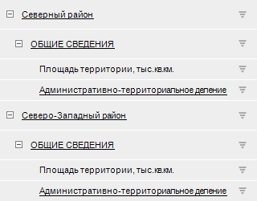
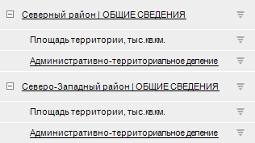

# IPivot.MergedNamingMode

IPivot.MergedNamingMode
-

# IPivot.MergedNamingMode

## Синтаксис

MergedNamingMode: [PivotMergedNamingMode](../../Enums/PivotMergedNamingMode.htm);

## Описание

Свойство MergedNamingMode определяет
 способ объединения наименований элементов различных измерений.

## Комментарии

Для отображения объединения в экспресс-отчёте должно быть установлено
 размещение по всем измерениям. Для этого:

	- Перейдите на вкладку «Конструктор»
	 ленты инструментов.

	- Нажмите на кнопку «Размещение».

	- Установите флажок «[Все измерения](UiAnalyticalArea.chm::/TableView/Layout/Merging_Dimensions.htm)».

Объединяться будут наименования элементов измерения, расположенного
 первым по строкам/столбцам и наименование элемента измерения, заданного
 в свойстве [IPivotDimensionSettingsEx.MergedElement](../IPivotDimensionSettingsEx/IPivotDimensionSettingsEx.MergedElement.htm).
 Настройка [IPivotDimensionSettingsEx.MergedElement](../IPivotDimensionSettingsEx/IPivotDimensionSettingsEx.MergedElement.htm)
 может быть задана для любого измерения, кроме самого первого, расположенного
 по строкам/столбцам.

## Пример

Для выполнения примера разместите на форме компонент Button, UiErAnalyzer
 и TabSheetBox с наименованиями «Button1», «UiErAnalyzer1» и «TabSheetBox1»
 соответственно. В качестве источника данных для «TabSheetBox1» укажите
 «UiErAnalyzer1» в свойстве Source.
 Источником данных для «UiErAnalyzer1» является экспресс-отчёт, заданный
 в свойстве Object. Также для «UiErAnalyzer1»
 установите свойству Active значение
 True.

Добавьте ссылки на системные сборки: Dimensions, Express, Forms, Pivot,
 Tab.

Пример является обработчиком события OnClick для компонента «Button1».

			Sub Button1OnClick(Sender: Object; Args: IMouseEventArgs);

Var

    Eax: IEaxAnalyzer;

    Pivot: IPivot;

    Key: Integer;

    DimSettings: IPivotDimensionSettingsEx;

Begin

    Eax := UiErAnalyzer1.ErAnalyzer;

    Pivot := Eax.Pivot;

    // Зададим способ объединения элементов измерения и разделитель, который будет использоваться в наименовании

    Pivot.MergedNamingMode := PivotMergedNamingMode.UpperElement Or PivotMergedNamingMode.LowerElement;

    Pivot.MergedNamingSeparator := " | ";

    // Получим ключ второго измерения, расположенного в боковике

    Key := Pivot.LeftHeader.Dim(1).Key;

    // Настроим измерения

    DimSettings := Pivot.Dimensions.FindByKey(Key).Settings;

    DimSettings.MergedElement := 0;

    Debug.WriteLine("Количество элементов в отметке: " + DimSettings.MergedSelection.SelectedCount.ToString);

    If DimSettings.MergeTopDown = True Then

        Debug.WriteLine("Объединение элементов используется с поджатием");

    Else

        Debug.WriteLine("Объединение элементов используется без поджатия");

    End If;

End Sub Button1OnClick;

После нажатия на кнопку в боковике экспресс-отчёта будет включено объединение
 наименований элементов верхнего уровня с первым элементом второго измерения.
 В консоль будет выведено количество объединённых элементов в отметке и
 признак использования поджатия. Например:

Количество элементов в отметке: 2

Объединение элементов используется с поджатием

Исходный вид боковика таблицы:

Вид боковика таблицы после выполнения примера:

См. также:

[IPivot](IPivot.htm)

		Справочная
		 система на версию 10.9
		 от 18/08/2025,
		 © ООО «ФОРСАЙТ»,
