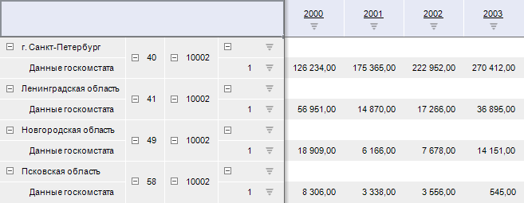
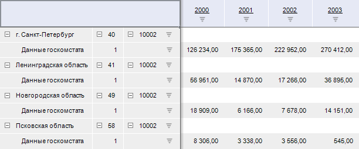

# IPivot.SeparateCombinedDimsNamings

IPivot.SeparateCombinedDimsNamings
-

# IPivot.SeparateCombinedDimsNamings

## Синтаксис

SeparateCombinedDimsNamings: Boolean;

## Описание

Свойство SeparateCombinedDimsNamings
 определяет признак объединения дополнительных атрибутов наименования у
 элементов в таблице.

## Комментарии

Объединение дополнительных [атрибутов
 наименования](UiSelection.chm::/Selection/Element_Names.htm#user) возможно при выборе двух и более измерений
 в одном заголовке. Если в качестве наименования у одного из измерений
 не выбран атрибут, который выбран у другого измерения, то ячейка для его
 элементов в столбце/строке будет пустая.

Для отображения объединения в экспресс-отчёте необходимо установить
 размещение по всем измерениям (перейдите на вкладку «Конструктор»
 ленты инструментов, нажмите на кнопку «Размещение»
 и установите флажок «[Все измерения](UiAnalyticalArea.chm::/TableView/Layout/Merging_Dimensions.htm)»).

Допустимые значения:

	- True. По умолчанию.
	 Дополнительные атрибуты измерений объединяются в одну иерархию:

	- False. Дополнительные
	 атрибуты измерений не объединяются в одну иерархию:

## Пример

Для выполнения примера предполагается наличие экспресс-отчёта с идентификатором
 EXPRESS:

	- Добавьте в отчёте таблицу данных.

	- Выберите два измерения с расположением [по
	 строкам](UiSelection.chm::/Selection/Dimension.htm#variant_of_locationbc-4).

	- Добавьте для измерений дополнительные [атрибуты
	 наименования](UiSelection.chm::/Selection/Element_Names.htm#user).

	- Перейдите на вкладку «Конструктор»
	 ленты инструментов, нажмите на кнопку «Размещение»
	 и установите флажок «Все измерения».

В модуле добавьте ссылки на системные сборки: Express, Metabase, Pivot.

			Sub UserProc;

Var

    Metabase: IMetabase;

    Analyzer: IEaxAnalyzer;

    Pivot: IPivot;

Begin

    // Получим репозиторий

    Metabase := MetabaseClass.Active;

    // Получим экспресс-отчёт

    Analyzer := Metabase.ItemById("EXPRESS").Edit As IEaxAnalyzer;

    // Получим таблицу экспресс-отчёта

    Pivot := Analyzer.Pivot;

    // Отменим объединение дополнительных атрибутов

    Pivot.SeparateCombinedDimsNamings := False;

    // Сохраним изменения в экспресс-отчёте

    (Analyzer As IMetabaseObject).Save;

End Sub UserProc;

В результате выполнения примера в экспресс-отчёте дополнительные атрибуты
 измерений в таблице не будут объединены.

См. также:

[IPivot](IPivot.htm)

		Справочная
		 система на версию 10.9
		 от 18/08/2025,
		 © ООО «ФОРСАЙТ»,
