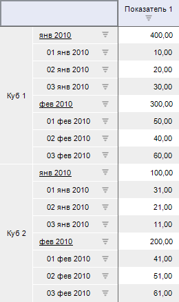
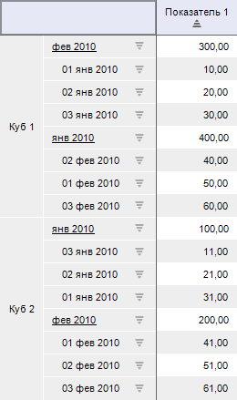

# IPivot.SortDiapason

IPivot.SortDiapason
-

# IPivot.SortDiapason

## Синтаксис

SortDiapason: [PivotSortDiapason](../../Enums/PivotSortDiapason.htm);

## Описание

Свойство SortDiapason определяет
 режим сортировки в таблице.

## Пример

Для выполнения примера разместите на форме компоненты Button, TabSheetBox,
 UiErAnalyzer с наименованиями «Button1», «TabSheetBox1» и «UiErAnalyzer1»
 соответственно. Для «TabSheetBox1» укажите источник данных «UiErAnalyzer1».
 Для «UiErAnalyzer1» источником данных является экспресс-отчёт.

Добавьте ссылки на системные сборки: Express, Forms, Pivot, Tab.

Пример является обработчиком события OnClick для компонента «Button1».

			Sub Button1OnClick(Sender: Object; Args: IMouseEventArgs);

Var

    OLAP: IEaxAnalyzer;

    Pivot: IPivot;

    Sorter: IPivotSorter;

    SortItem: IPivotSortItem;

Begin

    OLAP := UiErAnalyzer1.ErAnalyzer;

    Pivot := OLAP.Pivot;

    Sorter := Pivot.Sorter;

    // Зададим параметры сортировки

    SortItem := Sorter.Add;

    SortItem.Kind := PivotSortKind.Column;

    SortItem.IndexInHeader := 0;

    SortItem.Direction := PivotSortDirection.Asc;

    Pivot.SortDiapason := PivotSortDiapason.Level;

    // Обновим таблицу

    Pivot.Refresh;

End Sub Button1OnClick;

При нажатии на кнопку будет установлена сортировка по возрастанию значений
 первого столбца таблицы. Сортировка будет осуществляться по уровням иерархии
 в пределах одной группы.

Исходные данные:

Отсортированные данные:

См. также:

[IPivot](IPivot.htm)

		Справочная
		 система на версию 10.9
		 от 18/08/2025,
		 © ООО «ФОРСАЙТ»,
