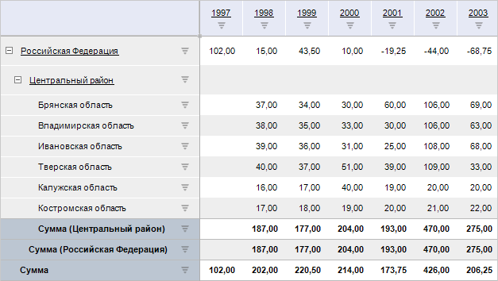
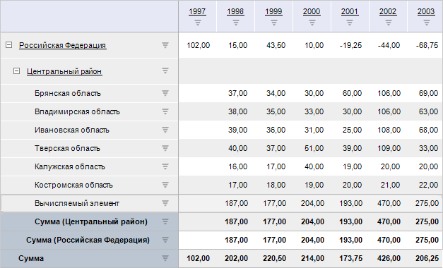

# IPivotClass.SubTotal

IPivotClass.SubTotal
-

# IPivotClass.SubTotal

## Синтаксис

SubTotal(Type: [PivotEvaluatorElementType](../../Enums/PivotEvaluatorElementType.htm);

[Relation: Variant =
 Null;]

[Position: [PivotTotalPosition](../../Enums/PivotTotalPosition.htm)
 = 0]): Variant;

## Параметры

Type. Метод вычисления промежуточных
 итогов;

Relation. Элемент измерения,
 по которому необходимо получить рассчитанный промежуточный итог;

Position. Расположение итога
 (по строкам/по столбцам).

## Описание

Метод SubTotal возвращает значение
 промежуточного итога, т.е. значение итога элементов измерения по элементу
 вышестоящего измерения.

## Комментарии

Метод предназначен для использования в [формулах
 преобразования](KeExpress.chm::/Interface/IEaxDataAreaTransformation/IEaxDataAreaTransformation.htm) вычисляемых элементов аналитической
 области данных. В выражениях формул указывается только наименование метода
 SubTotal без класса [PivotClass](../../Class/PivotClass/PivotClass.htm). Вызов метода из макросов
 на Fore не поддерживается.

[Использование
 метода SubTotal в качестве функции в выражениях формул преобразования
 данных](javascript:TextPopup(this))

	При использовании метода SubTotal
	 в качестве функции в выражениях формул учитывайте следующие особенности:

		- если вычисляемый элемент расположен в столбцах и функция
		 задана с параметром «Итоги по столбцам» или если вычисляемый элемент
		 расположен в строках и функция задана с параметром «Итоги по строкам»:

			- если функция SubTotal
			 задается для существующего элемента измерения без указания
			 конкретного элемента в формуле и для таблицы рассчитан соответствующий
			 метод итога, то промежуточный итог будет вычислен по данному
			 элементу;

			- если был добавлен новый вычисляемый элемент и для него
			 не была рассчитана формула, откуда можно взять итог, то значение
			 функции SubTotal по
			 данному вычисляемому элементу будет пустым;

			- если в шапке/боковике таблицы с данными содержится несколько
			 измерений, промежуточный итог будет рассчитан по последнему
			 измерению в шапке/боковике;

			- если для вычисляемого элемента в формуле указать другой
			 элемент, то промежуточный итог будет рассчитан по указанному
			 элементу;

		- если вычисляемый элемент расположен в столбцах и функция
		 задана с параметром «Итоги по строкам» или если вычисляемый элемент
		 расположен в строках и функция задана с параметром «Итоги по столбцам»,
		 то значение вычисляемого элемента будет соответствовать значению
		 промежуточного итога по строкам/столбцам соответственно.

	Если промежуточный итог по строкам/столбцам не рассчитан, то соответствующая
	 функция, заданная в формулах, вернёт пустое значение. Например, если
	 формула задана как SubTotal,
	 но итог «Сумма» по столбцам для таблицы не рассчитан, то данная функция
	 вернет пустое значение.

Обязательным требованием для работы метода является включение расчета
 необходимых итогов для [строк](../IPivotEvaluatorTotals/IPivotEvaluatorTotals.RowTypes.htm)/[столбцов](../IPivotEvaluatorTotals/IPivotEvaluatorTotals.ColumnTypes.htm)
 таблицы. Если итоги не рассчитываются, то метод вернет пустые значения.

Параметр Relation является
 необязательным. Если он не указан, то метод вернет промежуточный итог
 того элемента, после которого создается вычисляемый элемент. В качестве
 значения параметра Relation необходимо
 указывать элемент того измерения, для которого создается вычисляемый элемент.
 При указании параметра Relation
 метод вернет промежуточный итог, рассчитанный по указываемому элементу.
 Если в шапке/боковике несколько измерений, то будет браться промежуточный
 итог по последнему измерению шапки/боковика.

Параметр Position является
 необязательным. Если он не указан или значение совпадает с расположением
 создаваемого вычисляемого элемента, то метод вернет итог элемента, для
 которого задается формула преобразования. Если указывается значение, являющееся
 противоположным относительно расположения вычисляемого элемента (вычисляемый
 элемент расположен в столбцах и указывается значение [PivotTotalPosition.Rows](../../Enums/PivotTotalPosition.htm),
 и наоборот), то метод вернет значение промежуточного итога по строкам/столбцам
 соответственно.

Для создания формул и выражений смотрите статью «[Создание формул и выражений](UiNav.chm::/GUI/ExpressionEditor.htm)».

Пример настройки вычисляемых элементов приведен в [IEaxDataAreaSlice.CalcTransformations](KeExpress.chm::/Interface/IEaxDataAreaSlice/IEaxDataAreaSlice.CalcTransformations.htm).

## Пример использования в выражениях

Выражение:

SubTotal(PivotEvaluatorElementType.Sum, Null, PivotTotalPosition.Rows);

Результат: расположенный по строкам промежуточный итог в виде суммы
 соответствующих измерений, находящихся выше вычисляемого элемента.

Было:

Стало:

Применение: можно использовать в формулах вычисляемых элементов.

См. также:

[IPivotClass](IPivotClass.htm)

		Справочная
		 система на версию 10.9
		 от 18/08/2025,
		 © ООО «ФОРСАЙТ»,
