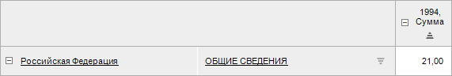

# IPivotDimElementsDetailing.Add

IPivotDimElementsDetailing.Add
-

# IPivotDimElementsDetailing.Add

## Синтаксис

Add ([Elements](../IPivotDimElementsDetailingItem/IPivotDimElementsDetailingItem.htm):
 [IDimSelection](KeDims.chm::/interface/IDimSelection/IDimSelection.htm)):
 [IPivotDimElementsDetailingItem](../IPivotDimElementsDetailingItem/IPivotDimElementsDetailingItem.htm);

## Параметры

Elements. Отметка измерения.

## Описание

Метод Add осуществляет добавление
 детализации в конец коллекции.

## Комментарии

Для удаления детализации по индексу используйте метод [IPivotDimElementsDetailing.Remove](IPivotDimElementsDetailing.Remove.htm).

Для очищения коллекции детализаций используйте метод [IPivotDimElementsDetailing.Clear](IPivotDimElementsDetailing.Clear.htm).

## Пример

Для выполнения примера разместите на форме компоненты Button, EaxDocumentViewerBox
 и UiErAnalyzer с идентификаторами «Button1», «EaxDocumentViewerBox1» и
 «UiErAnalyzer1» соответственно. В качестве источника данных для «EaxDocumentViewerBox1»
 укажите «UiErAnalyzer1». Источником данных для «UiErAnalyzer1» является
 экспресс-отчёт.

Добавьте ссылки на системные сборки: Dimension, Drawing, Express, ExtCtrls,
 Forms, Pivot, Tab.

Пример является обработчиком события OnClick для компонента «Button1».

			Sub Button1OnClick(Sender: Object; Args: IMouseEventArgs);

Var

    Pivot : IPivot;

    Detailing: IPivotDimElementsDetailing;

    DetailItem : IPivotDimElementsDetailingItem;

    Sel: IDimSelection;

    Selset : IdimselectionSet;

Begin

    // Получим таблицу

    Pivot := UiErAnalyzer1.ErAnalyzer.Grid.Pivot;

    // Добавим детализацию

    Detailing := Pivot.DimElementsDetailing;

    // Создадим отметку в измерении

    Sel := Pivot.Selection.Item(3).CreateCopy;

    Sel.DeselectAll;

    Sel.SelectElement(Sel.Dimension.Elements.FindById("10000"), False);

    // Добавим детализацию - фиксируем слева

    DetailItem := Detailing.Add(sel);

    // Определим коллекцию отметок измерения

    Selset := Pivot.Selection.CreateCopy;

    Selset.Item(2).DeselectAll;

    Selset.Item(2).SelectElement(Selset.Item(2).Dimension.Elements.FindById("1000"),False);

    DetailItem.Selection := Selset;

    If detailItem.Elements <> sel Then

        Debug.WriteLine("Ошибка");

    End If;

    End Sub Button1OnClick;

После нажатия кнопки в таблице экспресс-отчёта будет зафиксирован выбранный
 элемент измерения.

Исходный вид таблицы:

Вид таблицы после выполнения примера:

См. также:

[IPivotDimElementsDetailing](IPivotDimElementsDetailing.htm)

		Справочная
		 система на версию 10.9
		 от 18/08/2025,
		 © ООО «ФОРСАЙТ»,
