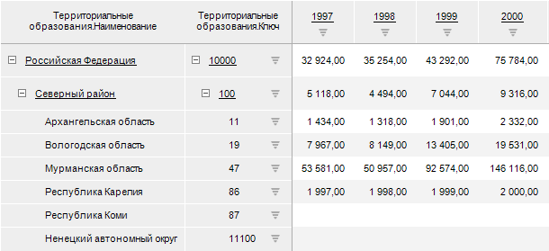
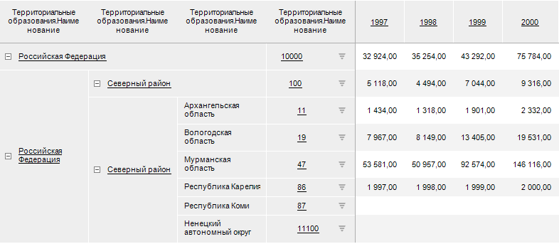

# IPivotDimensionSettings.IsJoinAdditionalAttributes

IPivotDimensionSettings.IsJoinAdditionalAttributes
-

# IPivotDimensionSettings.IsJoinAdditionalAttributes

## Синтаксис

IsJoinAdditionalAttributes: Boolean;

## Описание

Свойство IsJoinAdditionalAttributes
 возвращает признак того, объединены ли дополнительные наименования измерений.

## Комментарии

Допустимые значения:

	- True. Дополнительные
	 наименования объединены;

	- False. Дополнительные
	 наименования не объединены.

## Пример

Для выполнения примера в репозитории предполагается наличие экспресс-отчёта
 с идентификатором EXP_REP. В боковике таблицы отображаются атрибуты «Наименование»
 и «Ключ» в качестве наименований. Измерение боковика имеет несколько уровней.

Добавьте ссылки на системные сборки: Dimension, Express, Metabase, Pivot.

					Sub USerProc;

		Var

		    MB: IMetabase;

		    Express: IEaxAnalyzer;

		    Pivot: IPivot;

		    i, j: integer;

		    Header: IPivotTableHeader;

		    HeaderDim: IPivotDimensionSettingsEx;

		    Dim: IPivotDimension;

		Begin

		    // Получим репозиторий

		    MB := MetabaseClass.Active;

		    // Получим экспресс-отчет

		    Express := MB.ItemById("EXP_REP").Edit As IEaxAnalyzer;

		    // Получим настройки отображения таблицы данных отчета

		    Pivot := Express.Pivot;

		    // Получим измерение боковика

		    Dim := Pivot.LeftHeader.PivotDim(0);

		    // Расположим элементы уровней в отдельные столбцы

		    If Not Dim.IsSeparated Then

		        Dim.Separated := TriState.OnOption;

		    End If;

		    // Получим настройки измерения

		    HeaderDim := Dim.Settings;

		    // Объединим отображение дополнительных наименований

		    If Not HeaderDim.IsJoinAdditionalAttributes Then

		        HeaderDim.JoinAdditionalAttributes := TriState.OnOption;

		    End If;

		    // Получим свойства боковика таблицы

		    Header := Pivot.ObtainTable.LeftHeader;

		    // Определим, содержит ли боковик дополнительное наименование

		    For i := 0 To Header.SlotCount - 1 Do

		        Debug.WriteLine(Header.IsJoinSlot(i));

		    End For;

		    // Сохраним изменения

		    (Express As IMetabaseObject).Save;

		End Sub USerProc;

В результате выполнения примера:

	- в окно консоли для каждого столбца боковика будет выведено объединено
	 ли дополнительное наименование;

	- в экспресс-отчёте будет изменено расположение элементов уровней
	 и объединено отображение дополнительных наименований:

	Исходная таблица Полученная таблица

		

		

См. также:

[IPivotDimensionSettings](IPivotDimensionSettings.htm)

		Справочная
		 система на версию 10.9
		 от 18/08/2025,
		 © ООО «ФОРСАЙТ»,
