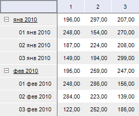
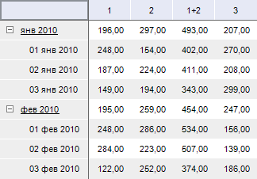

# IPivotEvaluatorDimCalculatesItem.AddCalculatedElement

IPivotEvaluatorDimCalculatesItem.AddCalculatedElement
-

# IPivotEvaluatorDimCalculatesItem.AddCalculatedElement

## Синтаксис

AddCalculatedElement(Name: String; RelationElement:
 Integer; Relation: [DimRelation](KeDims.chm::/Enums/DimRelation.htm)):
 Integer;

## Параметры

Name. Наименование нового вычисляемого
 элемента;

RelationElement. Элемент, относительно
 которого, будет позиционироваться вычисляемый элемент;

Relation. Позиция вставки вычисляемого
 элемента относительно элемента RelationElement.

## Описание

Метод AddCalculatedElement осуществляет
 создание нового вычисляемого элемента для данного измерения.

## Пример

Для выполнения примера предполагается наличие
 формы, расположенной на ней кнопки с наименованием «Button1», компонента
 TabSheetBox и компонента UiErAnalyzer с наименованием «UiErAnalyzer1»,
 являющегося источником данных для TabSheetBox.

			Sub Button1OnClick(Sender: Object; Args: IMouseEventArgs);

Var

    OLAP: IEaxAnalyzer;

    Pivot: IPivot;

    Dim: IDimInstance;

    Calcs: IPivotEvaluatorDimCalculates;

    Calc: IPivotEvaluatorDimCalculatesItem;

    Sel: IDimSelection;

    Elements: IDimElements;

    Element1, Element2: String;

    i: Integer;

Begin

    OLAP := UiErAnalyzer1.ErAnalyzer;

    Pivot := OLAP.Pivot;

    Dim := Pivot.TopHeader.Dim(0);

    Calcs := Pivot.Evaluator.DimCalculates;

    Calc := Calcs.FindByDimKey(Dim.Key);

    Sel := Pivot.Selection.FindByKey(Dim.Key);

    Elements := Calc.Dim.Elements;

    Element1 := Elements.Id(Sel.Element(0));

    Element2 := Elements.Id(Sel.Element(1));

    i := Calc.AddCalculatedElement(Element1 + "+" + Element2, Sel.Element(1), DimRelation.Next);

    Calc.Expression(i).AsString := "@" + Element1 + "+ @" + Element2;

End Sub Button1OnClick;

При нажатии на кнопку для первого измерения, расположенного по столбцам,
 будет создан вычисляемый элемент, осуществляющий суммирование первого
 и второго элемента измерения. Вычисление осуществляется для элементов,
 присутствующих в отметке измерения.

Исходные данные:

Таблица с вычисляемым элементом:

См. также:

[IPivotEvaluatorDimCalculatesItem](IPivotEvaluatorDimCalculatesItem.htm)

		Справочная
		 система на версию 10.9
		 от 18/08/2025,
		 © ООО «ФОРСАЙТ»,
