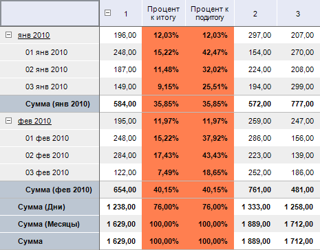

# IPivotEvaluatorDimCalculatesItem.AddPercentCalculate

IPivotEvaluatorDimCalculatesItem.AddPercentCalculate
-

# IPivotEvaluatorDimCalculatesItem.AddPercentCalculate

## Синтаксис

AddPercentCalculate(

Name: String;

RelationElement: Integer;

Relation: [DimRelation](KeDims.chm::/Enums/DimRelation.htm);

TotalDisposition: [PivotEvaluatorTotalDisposition](../../Enums/PivotEvaluatorTotalDisposition.htm);

TotalType: [PivotEvaluatorElementType](../../Enums/PivotEvaluatorElementType.htm)):
 Integer;

## Параметры

Name. Наименование создаваемого
 вычисляемого элемента;

RelationElement. Элемент измерения,
 относительно которого будет позиционироваться вычисляемый элемент;

Relation. Позиция вставки вычисляемого
 элемента относительно элемента RelationElement;

TotalDisposition. Вид итогов,
 относительно которых будет осуществляться расчет вычисляемого показателя;

TotalType. Тип итогов, относительно
 которых будет осуществляться расчет вычисляемого показателя. Для расчета
 вычисляемого показателя данный тип итогов должен рассчитываться в таблице.

## Описание

Метод AddPercentCalculate создает
 вычисляемый показатель, осуществляющий расчет процентного значения ячейки
 относительно итогового значения.

## Пример

Для выполнения примера предполагается наличие
 формы, расположенной на ней кнопки с наименованием «Button1», компонента
 UiErAnalyzer с наименованием «UiErAnalyzer1», и каких-либо компонентов,
 используемых для отображения данных отчета, загруженного в «UiErAnalyzer1»,
 например TabSheetBox.

Sub Button1OnClick(Sender: Object; Args: IMouseEventArgs);

Var

    OLAP: IEaxAnalyzer;

    Grid: IEaxGrid;

    Pivot: IPivot;

    Sel: IDimSelection;

    Totals: IPivotEvaluatorTotals;

    Dim: IDimInstance;

    Calcs: IPivotEvaluatorDimCalculates;

    Calc: IPivotEvaluatorDimCalculatesItem;

    Style: ITabCellStyle;

    i, i1: Integer;

Begin

    OLAP := UiErAnalyzer1.ErAnalyzer;

    Grid := OLAP.Grid;

    Pivot := OLAP.Pivot;

    //Итоги

    Totals := Pivot.Evaluator.Totals;

    Totals.RowTypes := PivotEvaluatorElementType.Sum;

    //Вычисляемый показател - Процент к итогу

    Dim := Pivot.TopHeader.Dim(0);

    Calcs := Pivot.Evaluator.DimCalculates;

    Calc := Calcs.FindByDimKey(Dim.Key);

    Sel := Pivot.Selection.FindByKey(Dim.Key);

    i := Calc.AddPercentCalculate("Процент к итогу", Sel.Element(0), DimRelation.Last,

        PivotEvaluatorTotalDisposition.Overall, PivotEvaluatorElementType.Sum);

    i1 := Calc.AddPercentCalculate("Процент к подитогу", Sel.Element(0), DimRelation.Last,

        PivotEvaluatorTotalDisposition.Sub_, PivotEvaluatorElementType.Sum);

    //Настройка формата

    Style := New TabCellStyle.Create;

    Style.BackgroundBrush := New GxSolidBrush.Create(GxColor.FromName("Coral"));

    Style.Font.Bold := TriState.OnOption;

    Style.CustomFormat := "0,00%";

    //Установка стиля для вычисляемых элементов

    Grid.Style.DimCalculateStyle(Dim.Key, Calc.CalculatedElement(i)) := Style;

    Grid.Style.DimCalculateStyle(Dim.Key, Calc.CalculatedElement(i1)) := Style;

    Grid.Refresh;

End Sub Button1OnClick;

После выполнения примера при нажатии на кнопку для экспресс-отчета,
 загруженного в «UiErAnalyzer1»,
 будет включен подсчет итогов. По строкам будет рассчитываться сумма значений.
 Также будут рассчитываться промежуточные значений итогов. Будут созданы
 два вычисляемых показателя, осуществляющих расчет на базе значений первого
 показателя, присутствующего в отметке по первому столбцу. Первый вычисляемый
 показатель будет рассчитывать процентное соотношение значений от общего
 итога, второй - процентное соотношение от промежуточных итогов. Для вычисляемых
 показателей будет настроен формат отображения.

Исходные данные:

Таблица с вычисляемыми элементами:

См. также:

[IPivotEvaluatorDimCalculatesItem](IPivotEvaluatorDimCalculatesItem.htm)

		Справочная
		 система на версию 10.9
		 от 18/08/2025,
		 © ООО «ФОРСАЙТ»,
