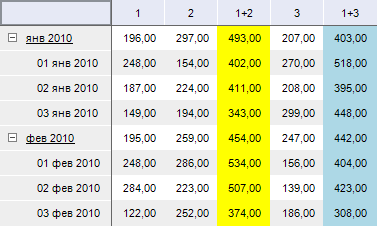

# IPivotEvaluatorDimCalculatesItem.CalculatedElement

IPivotEvaluatorDimCalculatesItem.CalculatedElement
-

# IPivotEvaluatorDimCalculatesItem.CalculatedElement

## Синтаксис

CalculatedElement(Index: Integer): Integer;

## Параметры

Index - индекс вычисляемого
 элемента по данному измерению.

## Описание

Свойство CalculatedElement возвращает
 уникальный идентификатор вычисляемого элемента в измерении.

## Комментарии

Индекс вычисляемого элемента передается посредством параметра Index. Уникальный идентификатор
 используется для привязки стиля оформления вычисляемых элементов.

## Пример

Для выполнения примера предполагается наличие
 формы, расположенной на ней кнопки с наименованием «Button1», компонента
 TabSheetBox и компонента UiErAnalyzer с наименованием «UiErAnalyzer1»,
 являющегося источником данных для TabSheetBox.

			Sub Button1OnClick(Sender: Object; Args: IMouseEventArgs);

Var

    OLAP: IEaxAnalyzer;

    Pivot: IPivot;

    Dim: IDimInstance;

    Calcs: IPivotEvaluatorDimCalculates;

    CalcItem: IPivotEvaluatorDimCalculatesItem;

    Sel: IDimSelection;

    Elements: IDimElements;

    i, j: Integer;

    Element1, Element2, Element3: String;

    EaxStyle: IEaxTableStyle;

    Style, Style1: ITabCellStyle;

Begin

    OLAP := UiErAnalyzer1.ErAnalyzer;

    Pivot := OLAP.Pivot;

    Dim := Pivot.TopHeader.Dim(0);

    Calcs := Pivot.Evaluator.DimCalculates;

    CalcItem := Calcs.FindByDimKey(Dim.Key);

    Sel := Pivot.Selection.FindByKey(Dim.Key);

    Elements := CalcItem.Dim.Elements;

    Element1 := Elements.Id(Sel.Element(0));

    Element2 := Elements.Id(Sel.Element(1));

    Element3 := Elements.Id(Sel.Element(2));

    i := CalcItem.AddCalculatedElement(Element1 + "+" + Element2, Sel.Element(1), DimRelation.Next);

    CalcItem.Expression(i).AsString := "@" + Element1 + "+ @" + Element2;

    j := CalcItem.AddCalculatedElement(Element1 + "+" + Element3, Sel.Element(2), DimRelation.Next);

    CalcItem.Expression(j).AsString := "@" + Element1 + "+ @" + Element3;

    //Оформление

    EaxStyle := OLAP.Grid.Style;

    Style := New TabCellStyle.Create;

    Style1 := New TabCellStyle.Create;

    Style.BackgroundBrush := New GxSolidBrush.Create(GxColor.FromName("Yellow"));

    Style.HorizontalAlignment := TabFormatAlignment.Center;

    Style.CustomFormat := "0,00";

    Style1.Assign(Style);

    Style1.BackgroundBrush := New GxSolidBrush.Create(GxColor.FromName("LightBlue"));

    //Установка стиля для выч.элемента

    EaxStyle.DimCalculateStyle(CalcItem.Dim.Key, CalcItem.CalculatedElement(i)) := Style;

    EaxStyle.DimCalculateStyle(CalcItem.Dim.Key, CalcItem.CalculatedElement(j)) := Style1;

    OLAP.Grid.Refresh;

End Sub Button1OnClick;

При нажатии на кнопку для первого измерения, расположенного по столбцам,
 будут созданы два вычисляемых элемента. Данные элементы будут располагаться
 после второго и третьего элемента измерения. Для каждого вычисляемого
 элемента будет настроен свой стиль оформления.

Исходные данные:

Таблица с вычисляемыми элементами:

См. также:

[IPivotEvaluatorDimCalculatesItem](IPivotEvaluatorDimCalculatesItem.htm)

		Справочная
		 система на версию 10.9
		 от 18/08/2025,
		 © ООО «ФОРСАЙТ»,
