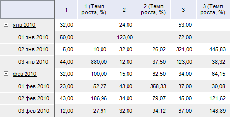

# IPivotEvaluatorDynamicsHeader.GrowthRate

IPivotEvaluatorDynamicsHeader.GrowthRate
-

# IPivotEvaluatorDynamicsHeader.GrowthRate

## Синтаксис

GrowthRate: Boolean;

## Описание

Свойство GrowthRate определяет
 признак расчета темпа роста значений.

## Комменатрии

По умолчанию свойству установлено значение False,
 при этом расчет темпа роста показателей не производится.

## Пример

Для выполнения примера предполагается наличие формы, расположенной на
 ней кнопки с наименованием «Button1», компонента TabSheetBox и компонента
 UiErAnalyzer с наименованием «UiErAnalyzer1», являющегося источником данных
 для TabSheetBox.

			Sub Button1OnClick(Sender: Object; Args: IMouseEventArgs);

Var

    OLAP: IEaxAnalyzer;

    Pivot: IPivot;

    Dynamics: IPivotEvaluatorDynamics;

    Dynamic: IPivotEvaluatorDynamicsHeader;

Begin

    OLAP := UiErAnalyzer1.ErAnalyzer;

    Pivot := OLAP.Pivot;

    Dynamics := Pivot.Evaluator.Dynamics;

    Dynamic := Dynamics.LeftHeader;

    Dynamic.GrowthRate := True;

    Dynamic.Slot := 0;

End Sub Button1OnClick;

При нажатии на кнопку для таблицы по строкам будет рассчитываться темп
 роста значений.

Исходные данные:

Темп роста значений:

См. также:

[IPivotEvaluatorDynamicsHeader](IPivotEvaluatorDynamicsHeader.htm)

		Справочная
		 система на версию 10.9
		 от 18/08/2025,
		 © ООО «ФОРСАЙТ»,
