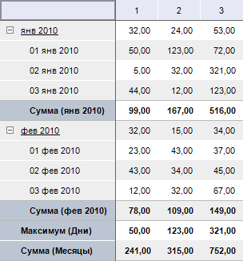

# IPivotEvaluatorTotals.Add

IPivotEvaluatorTotals.Add
-

# IPivotEvaluatorTotals.Add

## Синтаксис

Add(Dim: [IDimInstance](KeDims.chm::/interface/IDimInstance/IDimInstance.htm);
 BaseLevel: Integer; TotalTypes: Integer): [IPivotEvaluatorTotalsItem](../IPivotEvaluatorTotalsItem/IPivotEvaluatorTotalsItem.htm);

## Параметры

Dim. Измерения, по которому
 необходимо подсчитать итоги;

BaseLevel. Уровень измерения,
 по которому будут расчитываться итоги;

TotalTypes. Тип итогов, рассчитываемых
 на заданном уровне измерения.

## Описание

Метод Add осуществляет добавление
 элемента итогов, рассчитываемых по заданному уровню указанного измерения.

## Комментарии

В качестве значения параметра TotalTypes
 необходимо задавать десятичное число, соответствующее виду итогов.
 Для составления комбинации итогов необходимо указывать сумму значений
 соответствующих итогов. Значения итогов, которые можно рассчитать, содержатся
 в перечислимом типе [PivotEvaluatorElementType](../../Enums/PivotEvaluatorElementType.htm).

## Пример

Для выполнения примера предполагается наличие формы, расположенной на
 ней кнопки с наименованием «Button1», компонента TabSheetBox и компонента
 UiErAnalyzer с наименованием «UiErAnalyzer1», являющегося источником данных
 для TabSheetBox. Для экспресс-отчета, загруженного в «UiErAnalyzer1»,
 в качестве первого измерения, установленного по строкам, является календарное
 измерение.

	Sub Button1OnClick(Sender: Object; Args: IMouseEventArgs);

	Var

	    OLAP: IEaxAnalyzer;

	    Pivot: IPivot;

	    Totals: IPivotEvaluatorTotals;

	    Dim: IDimInstance;

	Begin

	    OLAP := UiErAnalyzer1.ErAnalyzer;

	    Pivot := OLAP.Pivot;

	    Dim := Pivot.LeftHeader.Dim(0);

	    Totals := Pivot.Evaluator.Totals;

	    Totals.Add(Dim, Dim.Levels.Item(0).Number, PivotEvaluatorElementType.Sum);

	    Totals.Add(Dim, Dim.Levels.Item(1).Number, PivotEvaluatorElementType.Max);

	    Pivot.Refresh;

	End Sub Button1OnClick;

После выполнения примера при нажатии на кнопку для таблицы будут рассчитываться
 следующие итоги: по уровню Дни - максимальное значение; по уровню Месяцы
 - Сумма.

См. также:

[IPivotEvaluatorTotals](IPivotEvaluatorTotals.htm)

		Справочная
		 система на версию 10.9
		 от 18/08/2025,
		 © ООО «ФОРСАЙТ»,
