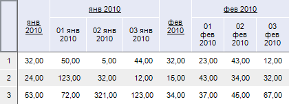
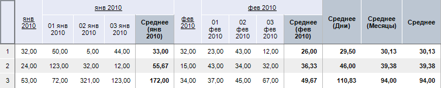

# IPivotEvaluatorTotals.ColumnTypes

IPivotEvaluatorTotals.ColumnTypes
-

# IPivotEvaluatorTotals.ColumnTypes

## Синтаксис

ColumnTypes: Integer;

## Описание

Свойство ColumnTypes определяет
 тип итогов, рассчитываемых по столбцам.

## Комментарии

В качестве значения данного параметра необходимо задавать десятичное
 число, соответствующее виду итогов. Для составления комбинации итогов
 необходимо указывать сумму значений соответствующих итогов. Для отмены
 подсчета итогов по столбцам необходимо данному свойству установить значение
 «0». Значения итогов, которые можно рассчитать, содержатся в перечислимом
 типе [PivotEvaluatorElementType](../../Enums/PivotEvaluatorElementType.htm).

## Пример

Для выполнения примера предполагается наличие формы, расположенной на
 ней кнопки с наименованием «Button1», компонента TabSheetBox и компонента
 UiErAnalyzer с наименованием «UiErAnalyzer1», являющегося источником данных
 для TabSheetBox.

			Sub Button1OnClick(Sender: Object; Args: IMouseEventArgs);

Var

    OLAP: IEaxAnalyzer;

    Pivot: IPivot;

    Totals: IPivotEvaluatorTotals;

Begin

    OLAP := UiErAnalyzer1.ErAnalyzer;

    Pivot := OLAP.Pivot;

    Pivot.Turn;

    Totals := Pivot.Evaluator.Totals;

    Totals.ColumnTypes := PivotEvaluatorElementType.Avg;

End Sub Button1OnClick;

После выполнения примера при нажатии на кнопку для таблицы по всем уровням
 измерения, расположенного по столбцам, будет рассчитываться итог: среднее
 значение.

Исходные данные:

Итоги по столбцам:

См. также:

[IPivotEvaluatorTotals](IPivotEvaluatorTotals.htm)

		Справочная
		 система на версию 10.9
		 от 18/08/2025,
		 © ООО «ФОРСАЙТ»,
