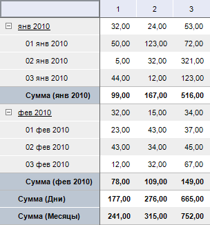
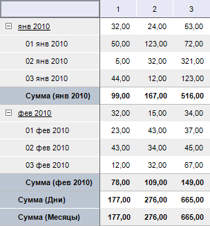

# IPivotEvaluatorTotals.IncludeOwner

IPivotEvaluatorTotals.IncludeOwner
-

# IPivotEvaluatorTotals.IncludeOwner

## Синтаксис

IncludeOwner: Boolean;

## Описание

Свойство IncludeOwner определяет,
 будут ли учитываться значения вершины при расчете итогов.

## Комментарии

Свойство актуально при расчете определенных видов итогов, учитывающих
 значение у дочерних элементов, например - Сумма. По умолчанию свойству
 установлено значение True, при
 этом учитывается значение вершины.

## Пример

IncludeOwner := True;

IncludeOwner := False;

См. также:

[IPivotEvaluatorTotals](IPivotEvaluatorTotals.htm)

		Справочная
		 система на версию 10.9
		 от 18/08/2025,
		 © ООО «ФОРСАЙТ»,
