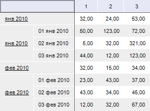
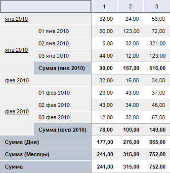

# IPivotEvaluatorTotals.RowTypes

IPivotEvaluatorTotals.RowTypes
-

# IPivotEvaluatorTotals.RowTypes

## Синтаксис

RowTypes: Integer;

## Описание

Свойство RowTypes определяет
 тип итогов, рассчитываемых по строкам.

## Комментарии

В качестве значения данного параметра необходимо задавать десятичное
 число, соответствующее виду итогов. Для составления комбинации итогов
 необходимо указывать сумму значений соответствующих итогов. Для отмены
 подсчета итогов по строкам необходимо данному свойству установить значение
 «0». Значения итогов, которые можно рассчитать, содержатся в перечислимом
 типе [PivotEvaluatorElementType](../../Enums/PivotEvaluatorElementType.htm).

## Пример

Для выполнения примера предполагается наличие формы, расположенной на
 ней кнопки с наименованием «Button1», компонента TabSheetBox и компонента
 UiErAnalyzer с наименованием «UiErAnalyzer1», являющегося источником данных
 для TabSheetBox.

			Sub Button1OnClick(Sender: Object; Args: IMouseEventArgs);

Var

    OLAP: IEaxAnalyzer;

    Pivot: IPivot;

    Totals: IPivotEvaluatorTotals;

Begin

    OLAP := UiErAnalyzer1.ErAnalyzer;

    Pivot := OLAP.Pivot;

    Totals := Pivot.Evaluator.Totals;

    Totals.RowTypes := PivotEvaluatorElementType.Sum;

End Sub Button1OnClick;

При нажатии на кнопку для таблицы по всем уровням измерения, расположенного
 по строкам, будут рассчитываться итоги: сумма значений.

Исходные данные:

Итоги по строками:

См. также:

[IPivotEvaluatorTotals](IPivotEvaluatorTotals.htm)

		Справочная
		 система на версию 10.9
		 от 18/08/2025,
		 © ООО «ФОРСАЙТ»,
