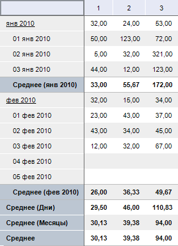
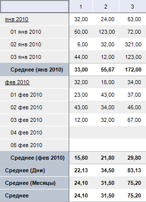

# IPivotEvaluatorTotals.TreatEmptyAsZero

IPivotEvaluatorTotals.TreatEmptyAsZero
-

# IPivotEvaluatorTotals.TreatEmptyAsZero

## Синтаксис

TreatEmptyAsZero: Boolean;

## Описание

Свойство TreatEmptyAsZero определяет,
 будут ли пустые значения рассматриваться как нули.

## Комментарии

Свойство актуально при расчете определенных видов итогов, учитывающих
 количество элементов в периоде, например - Среднее. По умолчанию свойству
 установлено значение False, при
 этом пустые значения не учитываются при расчете итогов.

## Пример

TreatEmptyAsZero := False;

TreatEmptyAsZero := True;

См. также:

[IPivotEvaluatorTotals](IPivotEvaluatorTotals.htm)

		Справочная
		 система на версию 10.9
		 от 18/08/2025,
		 © ООО «ФОРСАЙТ»,
