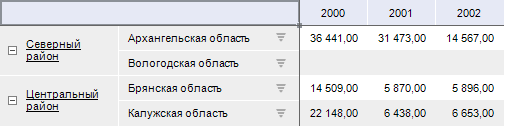
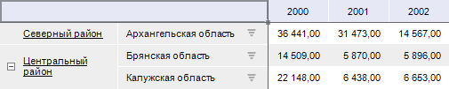

# IPivotFilterSettings.KeepNeighbors

IPivotFilterSettings.KeepNeighbors
-

# IPivotFilterSettings.KeepNeighbors

## Синтаксис

KeepNeighbors: Boolean;

## Описание

Свойство KeepNeighbors определяет,
 будут ли данные фильтроваться по уровням иерархии последнего измерения.

## Комментарии

Допустимые значения:

	- True. Данные будут фильтроваться
	 по уровням иерархии последнего измерения;

	- False. По умолчанию.
	 Данные не будут фильтроваться.

Если в уровне иерархии последнего измерения в шапке/боковике хотя бы
 один элемент не отфильтруется, то весь уровень, к которому относится данный
 элемент, фильтроваться не будет.

Пример фильтрации:

	- KeepNeighbors = True:

	- KeepNeighbors = False:

## Пример

Использование свойства приведено в примере для [IPivotFilterSettings.SupressEmpty](IPivotFilterSettings.SupressEmpty.htm).

См. также:

[IPivotFilterSettings](IPivotFilterSettings.htm)

		Справочная
		 система на версию 10.9
		 от 18/08/2025,
		 © ООО «ФОРСАЙТ»,
