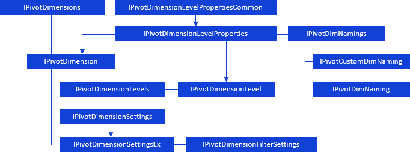

# Работа с измерениями источников данных

Работа с измерениями источников данных
-

# Работа с измерениями источников данных

Для работы с [набором
 измерений](UiSelection.chm::/Selection/Dimension.htm)
 источников данных основы для построения таблицы используйте интерфейсы:

[

Для работы с отметкой](../../Interface/IPivotDimensions/IPivotDimensions.htm)
 измерений используйте свойство [IPivot.Selection](../../Interface/IPivot/IPivot.Selection.htm).

Примечание.
 Все блоки с названиями интерфейсов являются гиперссылками, для перехода
 к их подробному описанию щелкните по ним мышью.

## Условные обозначения

		 
		 Класс_1
		 является потомком Интерфейса_1.

		 
		 Интерфейс_2
		 является потомком Интерфейса_1.

		 
		 Интерфейс_2
		 можно получить используя свойства/методы Интерфейса_1.

См. также:

[Иерархия
 сборки Pivot](../KePivot_Hierarchy.htm)

		Справочная
		 система на версию 10.9
		 от 18/08/2025,
		 © ООО «ФОРСАЙТ»,
