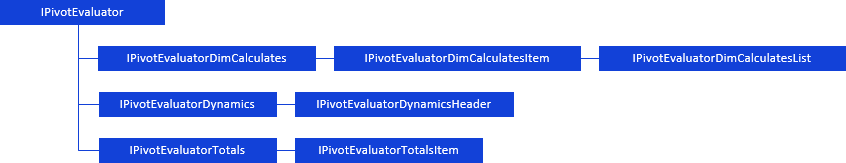

# Работа с вычисляемыми показателями

Работа с вычисляемыми показателями
-

# Работа с вычисляемыми показателями

К вычисляемым показателям относятся:

	- вычисляемые элементы по измерениям таблицы ([IPivotEvaluator.DimCalculates](../../Interface/IPivotEvaluator/IPivotEvaluator.DimCalculates.htm));

	- динамика изменения показателей измерения ([IPivotEvaluator.Dynamics](../../Interface/IPivotEvaluator/IPivotEvaluator.Dynamics.htm));

	- итоги таблицы ([IPivotEvaluator.Totals](../../Interface/IPivotEvaluator/IPivotEvaluator.Totals.htm)).

Для работы с вычисляемыми показателями таблицы используйте интерфейсы:

[

Примечание.
 Все блоки с названиями интерфейсов являются гиперссылками, для перехода
 к их подробному описанию щелкните по ним мышью.

## Условные обозначения

		 
		 Класс_1
		 является потомком Интерфейса_1.

		 
		 Интерфейс_2
		 является потомком Интерфейса_1.

		 
		 Интерфейс_2
		 можно получить используя свойства/методы Интерфейса_1.

См. также:

Иерархия
 сборки Pivot](../../Interface/IPivotEvaluator/IPivotEvaluator.htm)

		Справочная
		 система на версию 10.9
		 от 18/08/2025,
		 © ООО «ФОРСАЙТ»,
