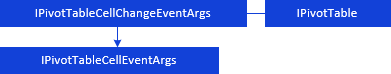

# Обработка событий таблицы

Обработка событий таблицы
-

# Обработка событий таблицы

При работе с таблицей доступна настройка обработки событий.

Обработчик событий позволяет
 выполнять заданное действие при каждом возникновении события. Например,
 при подключении модуля обработки события появляется возможность:

	- обрабатывать ввод данных «на лету»;

	- выводить диалог подтверждения выполняемого действия;

	- выполнять дополнительные действия перед и/или после возникновения
	 какого-либо события;

	- выводить информационные сообщения, содержащие определенную информацию
	 и др.

Для таблицы данных можно настроить обработку событий, происходящих:

	- перед и после смены отметки измерения;

	- перед сменой источника данных таблицы;

	- перед обновлением таблицы;

	- при изменении значений ячеек таблицы и др.

Для реализации событий таблицы с данными используйте методы интерфейса:

[

## Аргументы в обработчике событий

Для работы с аргументами обработчика событий используйте интерфейсы:

## Условные обозначения

		 
		 Класс_1
		 является потомком Интерфейса_1.

		 
		 Интерфейс_2
		 является потомком Интерфейса_1.

		 
		 Интерфейс_2
		 можно получить используя свойства/методы Интерфейса_1.

См. также:

Иерархия
 сборки Pivot](../../Interface/IPivotEvents/IPivotEvents.htm)

		Справочная
		 система на версию 10.9
		 от 18/08/2025,
		 © ООО «ФОРСАЙТ»,
