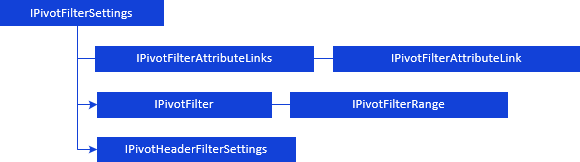

# Фильтрация данных

Фильтрация данных
-

# Фильтрация данных

[Фильтрация
 данных](UiAnalyticalArea.chm::/Working_with_table_data/Filtering.htm) позволяет отобразить в таблице только те данные,
 которые соответствуют заданным условиям.

Для определения параметров фильтрации данных таблицы используйте интерфейсы:

[

Примечание.
 Все блоки с названиями интерфейсов являются гиперссылками, для перехода
 к их подробному описанию щелкните по ним мышью.

## Условные обозначения

		 
		 Класс_1
		 является потомком Интерфейса_1.

		 
		 Интерфейс_2
		 является потомком Интерфейса_1.

		 
		 Интерфейс_2
		 можно получить используя свойства/методы Интерфейса_1.

См. также:

Иерархия
 сборки Pivot](../../Interface/IPivotFilterSettings/IPivotFilterSettings.htm)

		Справочная
		 система на версию 10.9
		 от 18/08/2025,
		 © ООО «ФОРСАЙТ»,
