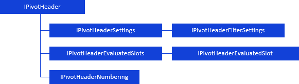

# Работа с заголовками таблицы

Работа с заголовками таблицы
-

# Работа с заголовками таблицы

Заголовки таблицы определяются элементами отметки измерений. Работа
 с заголовками служит для управления коллекцией измерений, расположенных
 в заданной области:

	- [по
	 столбцам](../../Interface/IPivot/IPivot.TopHeader.htm);

	- [по
	 строкам](../../Interface/IPivot/IPivot.LeftHeader.htm);

	- [фиксированные](../../Interface/IPivot/IPivot.FixedHeader.htm).

Для работы с заголовками таблицы используйте интерфейсы:

[

Примечание.
 Все блоки с названиями интерфейсов являются гиперссылками, для перехода
 к их подробному описанию щелкните по ним мышью.

## Условные обозначения

		 
		 Класс_1
		 является потомком Интерфейса_1.

		 
		 Интерфейс_2
		 является потомком Интерфейса_1.

		 
		 Интерфейс_2
		 можно получить используя свойства/методы Интерфейса_1.

См. также:

Иерархия
 сборки Pivot](../../Interface/IPivotHeader/IPivotHeader.htm)

		Справочная
		 система на версию 10.9
		 от 18/08/2025,
		 © ООО «ФОРСАЙТ»,
