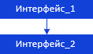

# Подсветка данных в таблице

Подсветка данных в таблице
-

# Подсветка данных в таблице

Подсветка позволяет с
 помощью оформления выделить (подсветить) данные, соответствующие заданным
 условиям.

Для определения условий подсветки данных таблицы используйте интерфейсы:

[

Примечание.
 Все блоки с названиями интерфейсов являются гиперссылками, для перехода
 к их подробному описанию щелкните по ним мышью.

## Условные обозначения

		 
		 Класс_1
		 является потомком Интерфейса_1.

		 
		 Интерфейс_2
		 является потомком Интерфейса_1.

		 
		 Интерфейс_2
		 можно получить используя свойства/методы Интерфейса_1.

См. также:

Иерархия
 сборки Pivot](../../Interface/IPivotHighlightItems/IPivotHighlightItems.htm)

		Справочная
		 система на версию 10.9
		 от 18/08/2025,
		 © ООО «ФОРСАЙТ»,
