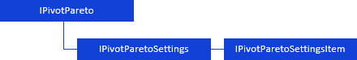

# Распределение

Распределение
-

# Распределение

[Распределение](UiAnalyticalArea.chm::/Analysis/distribution.htm) позволяет
 оставить в таблице набор значений, которые составят определенный процент
 (или число) от общей суммы. Остальные значения будут отображены общей
 суммой.

Для определения параметров распределения для различных элементов таблицы
 используйте интерфейсы:

[

Примечание.
 Все блоки с названиями интерфейсов являются гиперссылками, для перехода
 к их подробному описанию щелкните по ним мышью.

## Условные обозначения

		 
		 Класс_1
		 является потомком Интерфейса_1.

		 
		 Интерфейс_2
		 является потомком Интерфейса_1.

		 
		 Интерфейс_2
		 можно получить используя свойства/методы Интерфейса_1.

См. также:

Иерархия
 сборки Pivot](../../Interface/IPivotPareto/IPivotPareto.htm)

		Справочная
		 система на версию 10.9
		 от 18/08/2025,
		 © ООО «ФОРСАЙТ»,
