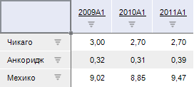
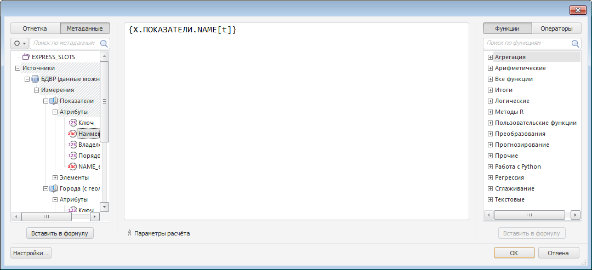
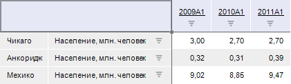

# Создание вычисляемого столбца в боковике таблицы

Создание вычисляемого столбца в боковике таблицы
-

# Создание вычисляемого столбца в боковике таблицы

## Описание

	Продукт «Форсайт. Аналитическая платформа»
	 с помощью языка программирования Fore
	 позволяет выводить вычисляемые значения в заголовках таблицы в виде:

		- отдельных столбцов в боковике таблицы;

		- отдельных строк в шапке таблицы.

	Значения в ячейках вычисляемых столбцов и строк рассчитываются по
	 формуле, состоящей из атрибутов измерения таблицы.

	Примечание.
	 Большое количество вычисляемых строк и столбцов может привести к снижению
	 производительности таблицы из-за расчета формул вычисляемых строк
	 и столбцов.

	В данном примере рассмотрено создание вычисляемого столбца в боковике
	 таблицы.

## Требования

	Для выполнения примера в репозитории предполагается наличие экспресс-отчета
	 с идентификатором «EXPRESS_SLOTS». Данный отчет должен содержать таблицу
	 данных.

	Добавьте ссылки на системные сборки: Dimensions, Express, Metabase,
	 Pivot, Ui.

## Пример

				Sub UserProc;

	Var

	    mb: IMetabase;

	    Report: IEaxAnalyzer;

	    Pivot: IPivot;

	    pHeader: IPivotHeader;

	    HeaderSlots: IPivotHeaderEvaluatedSlots;

	    Slot: IPivotHeaderEvaluatedSlot;

	    Getter: IDataAreaTransformationsGetter;

	    DataArea: IEaxDataArea;

	    Slice: IEaxDataAreaSlice;

	    SelSet: IDimSelectionSet;

	    Trans: IEaxDataAreaTransformations;

	    Tran: IEaxDataAreaTransformation;

	    Data: Array;

	    Target: IUiCommandTarget;

	    Context: IUiCommandExecutionContext;

	    Result: Variant;

	Begin

	    // Получаем текущий репозиторий

	    mb := MetabaseClass.Active;

	    // Получаем экспресс-отчет

	    Report := mb.ItemById("EXPRESS_SLOTS").Edit As IEaxAnalyzer;

	    // Получаем объект, на основе которого строится таблица данных

	    Pivot := Report.Pivot;

	    // Получаем параметры измерений, расположенных в боковике

	    pHeader := Pivot.LeftHeader;

	    // Получаем коллекцию вычисляемых столбцов, расположенных в боковике

	    HeaderSlots := pHeader.EvaluatedSlots;

	    // Удаляем все существующие вычисляемые столбцы

	    HeaderSlots.Clear;

	    // Добавляем новый вычисляемый столбец

	    Slot := HeaderSlots.Add;

	    // Получаем объект для работы с формулой столбца

	    Getter := Slot As IDataAreaTransformationsGetter;

	    // Добавляем формулу расчета

	    DataArea := Report.DataArea;

	    Slice := DataArea.Slices.Item(0);

	    Trans := Slice.GetTransformations(Getter);

	    SelSet := Pivot.Selection.CreateCopy;

	    Tran := Trans.Add(SelSet, Null, -1);

	    Tran.Enabled := True;

	    // Формируем параметры для вызова редактора выражения

	    Data := New Variant[4];

	    Data[0] := Report;

	    Data[1] := Tran;

	    Data[2] := Null;

	    Data[3] := SelSet;

	    // Вызываем редактор выражения, в котором пользователь самостоятельно

	    // задаст выражение для расчета формулы вычисляемого столбца

	    Target := WinApplication.Instance.GetPluginTarget("Express");

	    Context := Target.CreateExecutionContext;

	    Context.Data := data;

	    Result := Target.Execute("ShowFormulaEditor", context);

	    // Сохраняем изменения в отчете

	    (Report As IMetabaseObject).Save;

	End Sub UserProc;

	В результате выполнения примера в боковик таблицы экспресс-отчета
	 будет добавлен вычисляемый столбец. Формулу для расчета значений столбца
	 задаст пользователь в открывшемся редакторе выражения.

	Например, есть отчет содержащий следующую таблицу данных:

	

	В данной таблице измерение городов расположено по строкам, календарное
	 измерение - по столбцам, а измерение показателей зафиксировано.

	В результате выполнения примера будет открыт редактор выражения.
	 В нём будет сформирована следующая формула:

	

	Таким образом, в боковик таблицы будет добавлен вычисляемый столбец,
	 отображающий наименование показателя:

	

См. также:

[IPivotHeader.EvaluatedSlots](../Interface/IPivotHeader/IPivotHeader.EvaluatedSlots.htm)

		Справочная
		 система на версию 10.9
		 от 18/08/2025,
		 © ООО «ФОРСАЙТ»,
