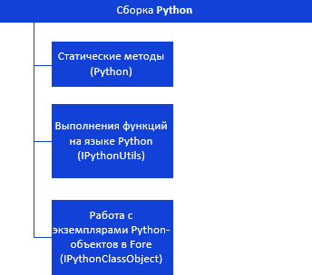
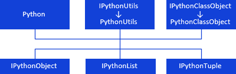
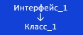

# Иерархия сборки Python

Иерархия сборки Python
-

# Иерархия сборки Python

Ниже представлена иерархия наследования и взаимодействия различных классов
 и интерфейсов в сборке Python. Все названия классов/интерфейсов являются
 гиперссылками, для перехода к их описанию щелкните по ним мышью.

Для выполнения функций на языке Python:

[

Получение результатов выполнения функций на языке Python:

## Условные обозначения

		 
		 Класс_1
		 является потомком Интерфейса_1.

		 
		 Интерфейс_2 является потомком Интерфейса_1.

		 
		 Интерфейс_2
		 можно получить используя свойства/методы Интерфейса_1.

См. также:

Введение
 в сборку Python](../../Class/Python/Python.htm) | [Использование
 сборки Python при разработке](../Use_Assembly_Python_In_Programm.htm)

		Справочная
		 система на версию 10.9
		 от 18/08/2025,
		 © ООО «ФОРСАЙТ»,
