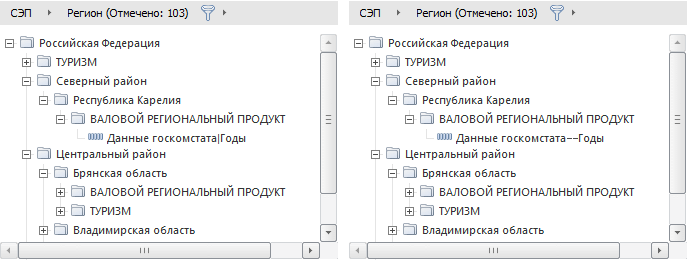

# IMetaAttributeNamings.NamingDelimiter

IMetaAttributeNamings.NamingDelimiter
-

# IMetaAttributeNamings.NamingDelimiter

## Синтаксис

NamingDelimiter: String;

## Описание

Свойство NamingDelimiter определяет
 разделитель наименований атрибутов.

## Комментарии

Коллекцию наименований атрибутов возвращает свойство [IMetaDictionary.AttributeNamings](../IMetaDictionary/IMetaDictionary.AttributeNamings.htm).

## Пример

Для выполнения примера предполагается наличие в репозитории базы данных
 временных рядов с идентификатором OBJ_FC с настроенными наименованиями
 показателей.

Добавьте ссылки на системные сборки Metabase, Rds, Cubes.

	Sub UserProc;

	Var

	    Mb: Imetabase;

	    Rubr: IRubricator;

	    F: IMetabaseObject;

	    Facts: IMetaDictionary;

	    Atts: IMetaAttributeNamings;

	    i: Integer;

	Begin

	    Mb := MetabaseClass.Active;

	    Rubr := MB.ItemById("OBJ_FC").Edit As IRubricator;

	    F := (Rubr.Facts As IMetabaseObject).Edit;

	    Facts := F.Edit As IMetaDictionary;

	    Atts := Facts.AttributeNamings;

	    Atts.NamingDelimiter := "--";

	    (Facts As IMetabaseObject).Save;

	End Sub UserProc;

После выполнения примера стандартный разделитель наименований атрибутов
 «|» (изображение слева) будет заменен на символы «--» (изображение справа):

См. также:

[IMetaAttributeNamings](IMetaAttributeNamings.htm)

		Справочная
		 система на версию 10.9
		 от 18/08/2025,
		 © ООО «ФОРСАЙТ»,
