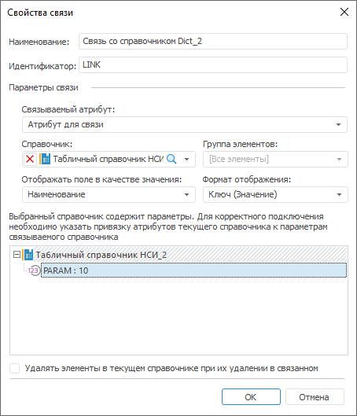

# IRdsParamsControl.Expression

IRdsParamsControl.Expression
-

# IRdsParamsControl.Expression

## Синтаксис

Expression(Param: [IRdsParam](../IRdsParam/IRdsParam.htm)):
 [IExpression](ForeSys.chm::/Interface/IExpression/IExpression.htm);

## Параметры

Param. Параметр связанного
 справочника, для которого необходимо определить значение.

## Описание

Свойство Expression возвращает
 выражение, определяющее постоянное значение параметра связываемого справочника.

## Пример

Для выполнения примера предполагается наличие репозитория НСИ с идентификатором
 NSI_1, содержащего справочники НСИ с идентификаторами DICT_1 и DICT_2.
 Для второго справочника добавлен дополнительный атрибут и параметр, в
 свойствах которого указан созданный атрибут.

Добавьте ссылки на системные сборки Dal, Metabase, Rds.

			Sub UserProc;

Var

    MB: IMetabase;

    MObj: IMetabaseObject;

    Dict, Dict2: IRdsDictionary;

    Attrs: IRdsAttributes;

    LinkAttr: IRdsAttribute;

    Link: IRdsLink;

    Param: IRdsParam;

    ParamsControl: IRdsParamsControl;

    Exp: IExpression;

Begin

    MB := MetabaseClass.Active;

    MObj := MB.ItemByIdNamespace("Dict_1", MB.ItemById("NSI_1").Key).Edit;

    Dict := MObj As IRdsDictionary;

    Dict2 := MB.ItemByIdNamespace("Dict_2", MB.ItemById("NSI_1").Key).Bind As IRdsDictionary;

    // Получим атрибуты первого справочника

    Attrs := Dict.Attributes;

    // Добавим атрибут для связи первого справочника со вторым

    LinkAttr := Attrs.Add;

    LinkAttr.DataType := DbDataType.Integer;

    LinkAttr.Id := "LinkAttr";

    LinkAttr.Name := "Атрибут для связи";

    // Добавим связь с параметрическим справочником

    Link := Dict.Links.Add;

    Link.Attribute := LinkAttr;

    Link.Reference := Dict2.Attributes.Key;

    Link.Id := "Link";

    Link.Name := "Связь со справочником Dict_2";

    // Получим параметр второго справочника из связи, которым необходимо управлять

    ParamsControl := Link.ParamsControl;

    Param := ParamsControl.ReferenceDictionary.Params.Item(0);

    // Установим значение «10» управляемому параметру

    Exp := ParamsControl.Expression(Param);

    Exp.AsString := "10";

    ParamsControl.Expression(Param) := Exp;

    MObj.Save;

End Sub UserProc;

После выполнения примера в первом справочнике будет создан атрибут с
 идентификатором LINKATTR, используемый для связи со вторым справочником.
 Между справочниками будет настроена связь по атрибуту KEY. В качестве
 значения параметра связываемого справочника с идентификатором DICT_2 будет
 установлено постоянное значение «10»:

См. также:

[IRdsParamsControl](IRdsParamsControl.htm)

		Справочная
		 система на версию 10.9
		 от 18/08/2025,
		 © ООО «ФОРСАЙТ»,
