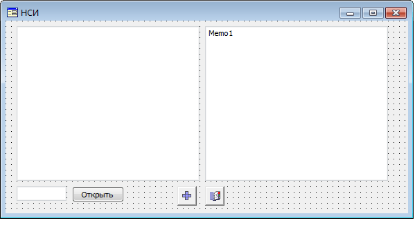
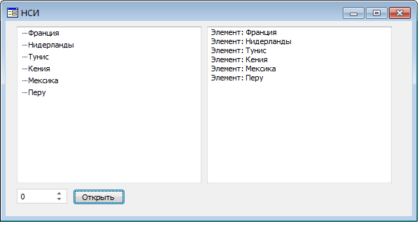
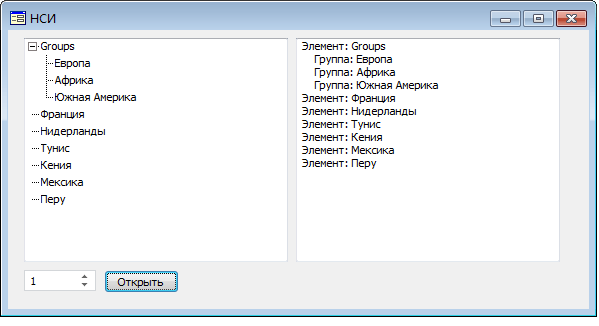
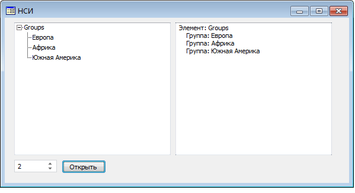

# Открытие справочника НСИ по различным измерениям

Открытие справочника НСИ по различным измерениям
-

# Открытие справочника НСИ по различным измерениям

Данные справочника НСИ можно получить в различной форме:

	- только элементы справочника;

	- элементы и группы справочника;

	- только группы справочника.

Для этого следует вызывать метод Open для справочника НСИ с параметром
 «RDSDIMTYPE». Данный параметр целочисленный и является необязательным.
 Значение параметра определяет, к какому виду будет приводится данные справочника
 НСИ:

	- 0 - только элементы
	 справочника;

	- 1 - элементы и группы
	 справочника;

	- 2 - только группы справочника.

Если параметр «RDSDIMTYPE» не задан, то будут открыты только элементы
 справочника.

Для выполнения примера в репозитории предполагается наличие справочник
 НСИ с идентификатором OBJ_DICTIONARY. Предполагается наличие формы, расположенной
 на ней кнопки Button1, и следующих компонентов: [UiDimension](UiDevEnv.chm::/02_Components_constructor_forms/03_Components_of_the_access_to_data/UiDimension.htm)
 с идентификатором UiDimension1, [UiRdsDictionary](UiDevEnv.chm::/02_Components_constructor_forms/03_Components_of_the_access_to_data/UiRdsDictionary.htm)
 с идентификатором UiRdsDictionary1, [IntegerEdit](UiDevEnv.chm::/02_Components_constructor_forms/02_Additional_components/IntegerEdit.htm)
 с идентификатором IntegerEdit1, [Memo](UiDevEnv.chm::/02_Components_constructor_forms/01_Standart_Components/Memo.htm)
 с идентификатором Memo1, а также компонента [DimensionTree](UiDevEnv.chm::/02_Components_constructor_forms/03_Components_of_the_access_to_data/DimensionTree.htm).
 Источником данных для компонента DimensionTree является UiDimension1.
 Для компонента IntegerEdit1 значение свойства [MinValue](ModForms.chm::/Interface/IIntegerEdit/IIntegerEdit.MinValue.htm)
 - 0, [MaxValue](ModForms.chm::/Interface/IIntegerEdit/IIntegerEdit.MaxValue.htm)
 - 2.

Форма выглядит следующим образом:

В компоненте IntegerEdit1 необходимо ввести значение параметра RDSDIMTYPE
 и нажать кнопку «Открыть». После этого пример будет выполнен.

			Sub Button1OnClick(Sender: Object; Args: IMouseEventArgs);

Var

    Metabase: IMetabase;

    Object: IMetabaseObjectDescriptor;

    Params: IMetabaseObjectParams;

    Param: IMetabaseObjectParam;

    Values: IMetabaseObjectParamValues;

    Dictionary: IRdsDictionaryInstance;

    Dict: IRdsDictionary;

    DimInstance: IDimInstance;

    Elements: IDimElements;

    Element, i: Integer;

Begin

    Metabase := MetabaseClass.Active;

    Object := Metabase.ItemById("OBJ_DICTIONARY");

    Object := Object.Edit;

    Params := Object.Params;

    Param := Params.Add;

    Param.Name := "RDSDIMTYPE";

    Param.Id := "RDSDIMTYPE";

    Param.DataType := DbDataType.Integer;

    Values := Params.CreateEmptyValues;

    Values.FindById("RDSDIMTYPE").Value := IntegerEdit1.Value;

    Dictionary := Object.Open(Values) As IRdsDictionaryInstance;

    DimInstance := Dictionary As IDimInstance;

    UiDimension1.Instance := DimInstance;

    Dict := Dictionary.Dictionary;

    UiRdsDictionary1.Object := Dict;

    UiRdsDictionary1.Open(Values);

    UiRdsDictionary1.Active := True;

    Memo1.Clear;

    Elements := DimInstance.Elements;

    For i := 0 To Elements.Count - 1 Do

        Element := Elements.Elements.Element(i);

        If Elements.IsGroup(Element) Then

            Memo1.Lines.Add(" Группа: " + Elements.Name(Element));

        Else

            Memo1.Lines.Add("Элемент: " + Elements.Name(Element));

        End If;

    End For;

End Sub Button1OnClick;

После выполнения примера справочник будет открыт с заданным значением
 параметра RDSDIMTYPE. Данные в виде дерева будут отображены в компоненте
 DimensionTree и описаны в компоненте Memo.

Пример открытия справочника с различными значениями параметра RDSDIMTYPE
 приведен ниже:

RDSDIMTYPE=0

RDSDIMTYPE=1

RDSDIMTYPE=2

См. также:

[Примеры](KeRds_Sample.htm)

		Справочная
		 система на версию 10.9
		 от 18/08/2025,
		 © ООО «ФОРСАЙТ»,
