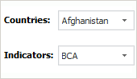

# PrxControlPanelOrientation

PrxControlPanelOrientation
-

# PrxControlPanelOrientation

## Описание

Перечисление PrxControlPanelOrientation содержит варианты расположения элементов управления в компоненте среды разработки [ReportControlPanel](UiDevEnv.chm::/02_Components_constructor_forms/03_Components_of_the_access_to_data/ReportControlPanel.htm).

Используется следующим свойством:

-
[IReportControlPanel.Orientation](../Interface/IReportControlPanel/IReportControlPanel.Orientation.htm).

## Допустимые значения

 Значение
 Краткое описание

 0
 Vertical. Располагать вертикально:

 1
 Horizontal. Располагать горизонтально:

См. также:

[Перечисления сборки Report](KeReport_Enums.htm)

		Справочная
		 система на версию 10.9
		 от 18/08/2025,
		 © ООО «ФОРСАЙТ»,
