# PrxShapeType

PrxShapeType
-

# PrxShapeType

## Описание

Перечисление PrxShapeType содержит типы автофигур.

Используется следующим свойством:

-
[IPrxShape.Type](../Interface/IPrxShape/IPrxShape.Type.htm).

## Допустимые значения

 Значение
 Краткое описание

 0
 Unknown. Служебное значение. Не должно использоваться пользователями.

 1
 Rectangle. Прямоугольник:

 3
 Link. Простая линия:
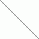

 4
 StraightLink. Соединительная линия:

 5
 Ellipse. Эллипс:

 6
 RoundedRectangle. Скругленный прямоугольник:

 7
 Triangle. Треугольник:
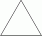

 8
 Square. Четырехугольник:
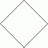

 9
 Pentagon. Пятиугольник:
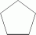

 10
 Hexagon. Шестиугольник:

 12
 Octagon. Восьмиугольник:
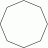

 13
 Arrow. Фигурная стрелка:
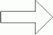

 14
 DoubleArrow. Двойная фигурная стрелка:
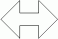

 15
 BoxArrow. Фигурная стрелка с выноской:
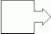

 16
 DoubleBoxArrow. Двойная фигурная стрелка с выноской:
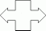

 17
 RectangleBaloon. Прямоугольная выноска:

 18
 RoundedRectangleBaloon. Скругленная прямоугольная выноска:

 19
 EllipseBaloon. Овальная выноска:

 20
 Link2PointBaloon. Выноска с двумя точками:
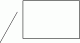

 21
 Link2PointLineBaloon. Выноска с двумя точками и чертой:
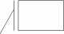

 22
 Link3PointBaloon. Выноска с тремя точками:
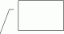

 23
 Link3PointLineBaloon. Выноска с тремя точками и чертой:
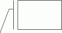

 24
 Link4PointBaloon. Выноска с четырьмя точками:

 25
 Link4PointLineBaloon. Выноска с четырьмя точками и чертой:

См. также:

[Перечисления сборки Report](KeReport_Enums.htm)

		Справочная
		 система на версию 10.9
		 от 18/08/2025,
		 © ООО «ФОРСАЙТ»,
