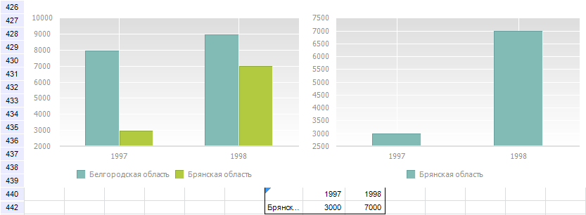

# IPrxChart.IncludeHidden

IPrxChart.IncludeHidden
-

# IPrxChart.IncludeHidden

## Синтаксис

IncludeHidden: Boolean;

## Описание

Свойство IncludeHidden определяет
 состояние опции «Отображать скрытые данные».

## Комментарии

Допустимые значения свойства:

	- True. На
	 диаграмме будут отображены все значения области данных, в том
	 числе и данные скрытых строк/столбцов;

	- False.
	 Диаграмма будет построена только по видимой области данных.

Ниже приведена область данных, часть строк которой скрыта. Пример диаграммы
 для представленной области данных, если значение IncludeHidden
 - True (слева) и IncludeHidden
 - False (справа):

## Пример

Пример использования
 приведен на странице описания свойства [IPrxChart.Points](IPrxChart.Points.htm).

См. также:

[IPrxChart](IPrxChart.htm)

		Справочная
		 система на версию 10.9
		 от 18/08/2025,
		 © ООО «ФОРСАЙТ»,
